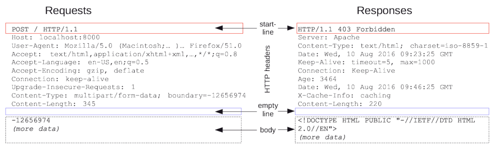
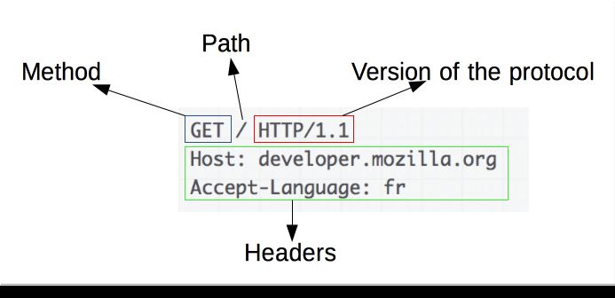
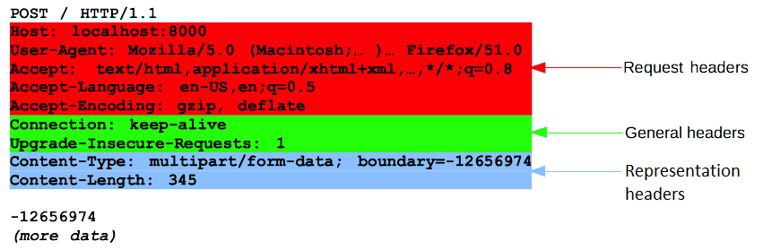
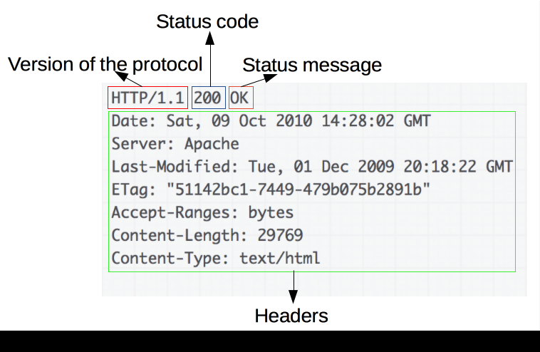
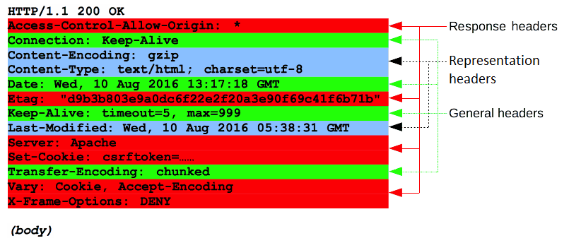
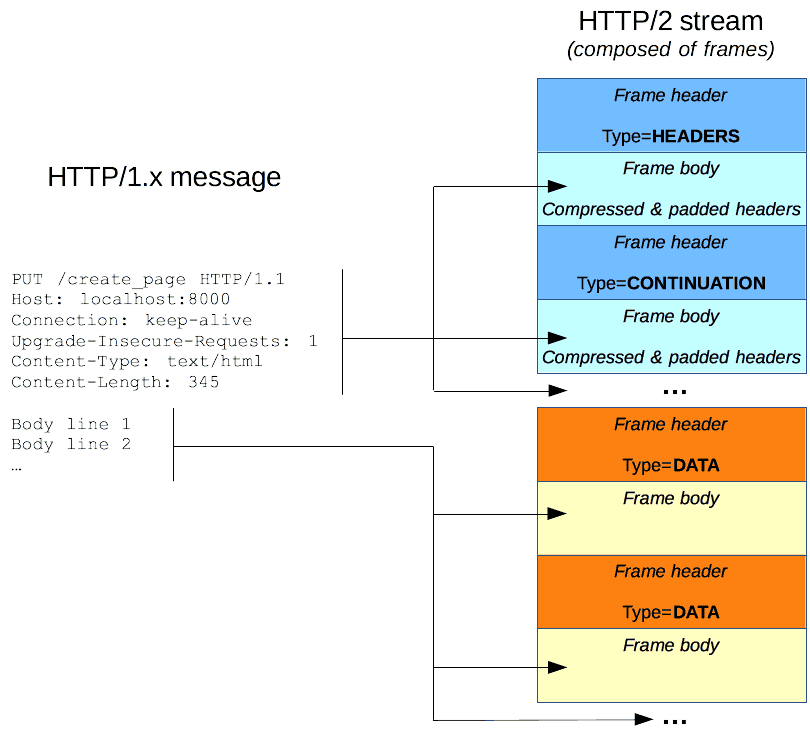

# HTTP

- [HTTP](#http)
- [HTTP Message](#http-message)
- [Request](#request)
  - [Start line](#start-line)
  - [Headers](#headers)
  - [Body](#body)
- [Response](#response)
  - [status line](#status-line)
  - [Headers](#headers-1)
  - [Body](#body-1)
- [HTTP/2 Frames](#http2-frames)
- [출처](#출처)

## HTTP

- HyperText Transfer Protocol
- 웹에서 이루어지는 모든 데이터 교환의 기초
- 클라이언트-서버 프로토콜
- 상태가 없음.
  - 세션으로 상태를 유지.
- 확장 가능

## HTTP Message

- 서버와 클라이언트 간에 데이터가 교환되는 방식
- ASCII로 인코딩된 텍스트 정보
- 요청(request)과 응답(response) 두 가지 타입이 존재
- **단순한 메시지 구조**를 이루고 있고, **확장성이 좋다**

- 시작 줄(start-line)
  - HTTP 요청, 응답 코드
  - 항상 한 줄로 끝남.
- HTTP 헤더
  - 요청에 대한 설명
  - 메시지 본문에 대한 설명
- 빈 줄
  - 요청에 대한 모든 메타 정보가 전송되었음을 알리는 빈 줄
  - 헤드와 본문의 경계
- 본문(optional)
  - 요청과 관련된 데이터(HTML form 콘텐츠 등)
  - 응답과 관련된 문서(document)가 선택적

## Request

### Start line

- Method + Path + HTTP 버전

- Method
  - GET
  - POST
  - PUT
  - HEAD - 헤더 정보만 보냄. 서버 상태나 정보를 얻기 위함.
  - OPTIONS - 어떤 메소드가 허용되는 지 확인.
- Path - URL, 요청 타겟
- HTTP 버전

### Headers

- 한줄로 된 키:벨류의 묶음.
- 각 헤더 필드 설명

- Request 헤더

  - Host: 서버의 도메인 이름(포트는 Optional)
  - User-Agent: 사용자 에이전트(클라이언트)의 브라우저, 운영 체제, 플랫폼 및 버전
  - Accept: 클라이언트가 이해 가능한 (허용하는) 파일 형식 (MIME TYPE)
  - Accept-Encoding: 클라이언트가 해석할 수 있는 인코딩, 콘텐츠 압축 방식
  - Authorization: 인증 토큰(JWT나 Bearer 토큰)을 서버로 보낼 때 사용하는 헤더, API 요청을 할 때 토큰이 없으면 거절을 당하기 때문에 이 때, Authorization을 사용
  - Origin: POST와 같은 요청을 보낼 때, 요청이 어느 주소에서 시작되었는지를 나타냄. 여기서 요청을 보낸 주소와 받는 주소가 다르면 CORS 문제가 발생하기도 함
  - Referer: 이 페이지 이전의 페이지 주소가 담겨 있음. 이 헤더를 사용하면 어떤 페이지에서 지금 페이지로 들어왔는지 알 수 있음
  - IF-Modified-Since: 최신 버전 페이지 요청을 위한 필드, 요청의 부하를 줄임. 서버는 지정된 날짜 이후에 마지막으로 수정된 경우에만 200 상태 코드로 요청된 리소스를 다시 보냄, 만약 이후에 리소스가 수정되지 않았다면 서버는 본문 없이 304 상태 코드로 응답을 보냄

- General 헤더

  - 메시지 전체에 적용되는 헤더
  - Connection: keep-alive
    - 현재의 전송이 완료된 후 네트워크 접속을 유지할지 말지를 제어

- Entity 헤더

  - 요청 본문에 적용되는 헤더
  - Content-Type: text/html; charset=UTF-8
    - 본문의 형태와 인코딩
  - Content-Length - 본문의 크기, 바이트 단위

### Body

- POST일 때 추가됨.
- 단일-리소스 본문(single-resource bodies)
  - 헤더 두 개(Content-Type, Content-Length)로 정의된 단일 파일
- 다중-리소스 본문(multiple-resource bodies)
  - multipart 본문으로 구성되는 다중 리소스 본문에서는 파트마다 다른 정보

## Response

### status line

- 프로토콜 버전 + 상태 코드 + 상태 텍스트

- protocol version
- status code
  - 1xx(조건부 응답) : 요청을 받았으며 작업을 계속함.
  - 2xx(성공) : 클라이언트의 요청을 승낙하여 성공적으로 처리함. 200 성공
  - 3xx(리다이렉션 완료) : 클라이언트는 요청을 마치기 위해 추가 동작을 해야 함.
  - 4xx(요청 오류) : 클라이언트의 요청에 오류가 있음. 404 페이지를 찾을 수 없음.
  - 5xx(서버 오류) : 서버가 유요한 요청을 수행하지 못했음.
- status text
  - 짧고 간결하게 상태 코드에 대한 설명을 글로 나타냄
  - 사람이 HTTP 메시지를 이해할 때 도움을 줌

### Headers

- Response 헤더: 상태 줄에 미처 들어가지 못했던 서버에 대한 추가 정보를 제공한다.

  - Access-Control-Allow-Origin: 요청 Host와 응답 Host가 다르면 CORS 에러가 발생하는데 서버에서 응답 메시지 Access-Control-Allow-Origin 헤더에 프론트 주소를 적어주면 에러가 발생하지 않는다.
  - 예) Access-Control-Allow-Origin: www.sample.com / Access-Control-Allow-Origin: \*
  - Set-Cookie: 서버 측에서 클라이언트에게 세션 쿠키 정보를 설정할 때 사용하는 항목 (RFC 2965에서 규정)
    - 예) Set-Cookie: zerocho=babo; Expires=Wed, 21 Oct 2015 07:28:00 GMT; Secure; HttpOnly
      - HttpOnly:
        - 자바스크립트에서 쿠키에 접근할 수 없다.
        - XSS 요청을 막으려면 활성화해두는 것이 좋다.
    - 쿠키는 XSS 공격과 CSRF 공격 등에 취약하기 때문에 HttpOnly 옵션을 켜두고, 쿠키를 사용하는 요청은 서버 단에서 검증하는 로직을 마련해두는 것이 좋다.

- General 헤더: 메시지 전체에 적용되는 헤더이다.

  - Server: 웹 서버 (소프트웨어) 정보

- Entity 헤더: 요청 본문에 적용되는 헤더이다. 요청 내에 본문이 없는 경우에는 당연히 전송되지 않는다.

  - Content-Encoding: 응답 콘텐츠 압축하는 방식, br, gzip, deflate 등의 알고리즘으로 압축해서 보내면, 브라우저가 알아서 해제해서 사용함, 요청이나 응답 전송 속도도 빨라지고, 데이터 소모량도 줄어들기 때문에 사용함
  - Content-Type: 콘텐츠의 미디어 타입(MIME Type). 반환된 콘텐츠 타입이 실제로 무엇인지 클라이언트에게 알려줌.
  - Date: 현재 날짜
  - Last-Modified: 요청한 파일의 최종 수정일

### Body

- 이미 **길이가 알려진 단일 파일**로 구성된 **단일-리소스 본문**
  - 헤더 두개(Content-Type와 Content-Length)로 정의 합니다.
- **길이를 모르는 단일 파일**로 구성된 **단일-리소스 본문**
  - Transfer-Encoding가 chunked로 설정되어 있으며, 파일은 청크로 나뉘어 인코딩 되어 있습니다.
- 서로 다른 정보를 담고 있는 멀티파트로 이루어진 다중 리소스 본문
  - 이 경우는 상대적으로 위의 두 경우에 비해 보기 힘듭니다.

## HTTP/2 Frames

- HTTP/1.x 메시지는 성능상의 결함
  - 본문은 압축이 되지만 헤더는 압축이 되지 않음.
  - 연속된 메시지들은 비슷한 헤더 구조를 띄기 마련인데, 그럼에도 불구하고 메시지마다 반복되어 전송.
  - 다중전송(multiplexing)이 불가능.

- HTTP/2 introduces an extra step
  - HTTP/1.x 메시지를 프레임으로 나누어 스트림에 끼워 넣는 것
  - 데이터와 헤더 프레임이 분리 되었기 때문에 헤더를 압축할 수 있음.
  - 멀티플렉싱
    - 스트림 여러개를 하나로 묶음.
    - TCP 연결이 좀 더 효율적함.

---

## 출처

- HTTP Messages - <https://developer.mozilla.org/en-US/docs/Web/HTTP/Messages>
- [Web] HTTP와 Request, Response의 개념 이해 - <https://velog.io/@bky373/Web-HTTP%EC%99%80-HTTPS-%EC%B4%88%EA%B0%84%EB%8B%A8-%EC%A0%95%EB%A6%AC>
