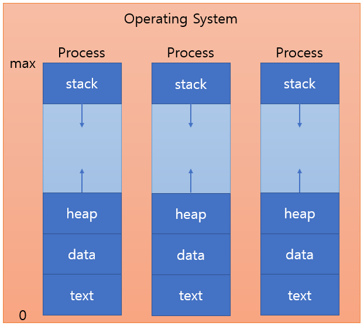
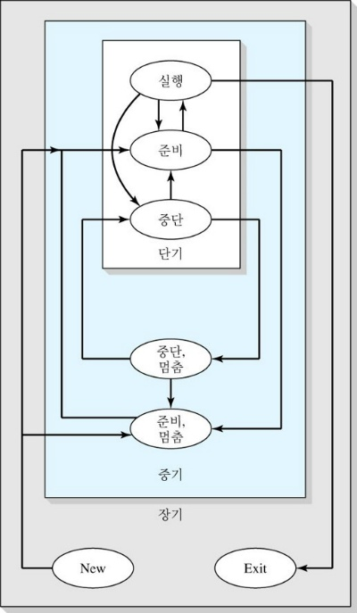

# 2. Process Management

- [2.1 Process](#21-process)
  - [2.1.1 프로세스의 상태](#211-프로세스의-상태)
  - [2.1.2 프로세스의 상태전이(process transition)](#212-프로세스의-상태전이process-transition)
- [2.2 프로세스 관리](#22-프로세스-관리)
  - [2.2.1 Multiprogramming](#221-multiprogramming)
  - [2.2.2 How multiprogramming increase effciency](#222-how-multiprogramming-increase-effciency)
  - [2.2.3 Process creation](#223-process-creation)
  - [2.2.4 Process termination](#224-process-termination)
  - [2.2.5 Process state](#225-process-state)
  - [2.2.6 Process description and control](#226-process-description-and-control)
  - [2.2.7 Processor modes](#227-processor-modes)
  - [2.2.8 Kernel system concept](#228-kernel-system-concept)
  - [2.2.9 Requesting system services](#229-requesting-system-services)
- [2.3 Process Scheduler](#23-process-scheduler)
  - [2.3.1 Waiting Queue(대기열)](#231-waiting-queue대기열)
  - [2.3.1 Scheduler](#231-scheduler)
  - [2.3.2 Scheduler Algorithm](#232-scheduler-algorithm)
- [출처](#출처)

## 2.1 Process

프로세스(Process)

실행되어 메인 메모리에 로드된 프로그램, Task, Job으로 부르기도 함

하나의 프로그램이 여러 개의 프로세스로 로드 될 수도 있음.

- 프로세스는 각각 독립된 메모리 영역을 할당 받음.
- 하나의 프로세스 안에 메인 스레드가 생성됨.
- 한 프로세스는 다른 프로세스의 변수에 접근 할 수 없음.
- 다른 프로세스의 자원에 접근하려면 프로세스 간 통신 IPC를 사용.
- 메모리 영역
  - text - executable code
  - data - global variables, static 변수
  - heap - 프로그램 run time 동안 할당되는 동적 메모리
  - stack - 함수가 수행되는 동안 임시 데이터 e.g. 함수 파라미터, 리턴 주소, 지역 변수

### 2.1.1 프로세스의 상태

- 생성(create, new) : PCB 생성, 메모리에 로드는 안됨.
- 실행(running) : CPU를 차지하여 명령어를 실행
- 준비(Ready) : CPU를 사용하고 있지 않지만 언제든지 사용 할 수 있는 상태. CPU할당을 기다림.
- 보류(Blocked) : 프로세스가 입출력 완료, 시그널 수신 등 어떤 이벤트를 기다리는 상태
- 종료(terminated, exit) : 어떤 이유로 종료 중인 상태.

> 우리나라 교재의 용어와 외국 wiki의 용어차이
>
> | 우리나라      | WIKI           |
> | ------------- | -------------- |
> | 준비(Ready)   | Ready, Waiting |
> | 대기(Waiting) | Block          |

### 2.1.2 프로세스의 상태전이(process transition)

| 용어     | 상태전이                   | 설명                                                                                                                   |
| -------- | -------------------------- | ---------------------------------------------------------------------------------------------------------------------- |
| dispatch | ready -> running           | 리스트 맨 앞의 프로세스가 cpu를 점유하는 것.                                                                           |
| block    | running -> blocked         | 실행 상태의 프로세스가 허가된 시간을 다 쓰기 전에 입출력 동작을 필요로 하는 경우 cpu를 스스로 반납하고 보류 상태가 됨. |
| wakeup   | blocked -> ready           | 이벤트가 발생할 때 보류 상태에서 준비 상태로 넘어가는 것.                                                              |
| timeout  | running -> ready           | 프로세스의 독점을 막기위해 clock interrupt를 두어서 프로세스가 일정 시간 동안만 프로세서를 점유할 수 있게 함.          |
| Swap-out | Raedy,Block -> Swapped out | 메모리 부족, I/O를 잃을 경우. 메모리 회수, 디스크에 저장                                                               |
| Swap-in  | Swapped out -> Ready,Block | 메모리 확보, I/O 회복. 메모리로 로드                                                                                   |

## 2.2 프로세스 관리

- 자원을 프로세스에 할당
- 프로세스가 정보를 공유하고 교환
- 각 프로세스 자원을 다른 프로세스로부터 보호
- 프로세스간 동기화

1. 사용자 모드에서 프로세스 A 실행
2. 시스템 콜 호출, A는 트랩에 걸림, 커널 모드로 전환
3. 커널 모드에서 시스템 콜 수행
4. 작업 수행에 따라 Running Queue나 Sleep Queue에 넣음.
5. 디스패처가 우선순위가 높은 B를 실행.
6. 프로세스 B가 실행

### 2.2.1 Multiprogramming

다중 프로그래밍, 멀티태스킹

- 동시 실행 - 한 기간 동안 여러 개의 프로세스가 실행되는 것.
- 요구사항 - 프로세서가 특정 기간 동안 각 프로세스에 할당 되고 적절한 순간 해제 되는 것.
  - 프로세스는 시스템 콜(소프트웨어 인트럽트) 발생 e.g I/O
  - 하드웨어 인터럽트 발생. e.g. 키보드 입력, Timeout
- Context Switching(문맥 교환) - 프로세스 하나를 멈추고 다른 프로세스를 시작 및 다시 시작 하는 것
- 쓰레드 - 프로세스의 하위 프로세스, 독립적 실행 시퀀스.

Context Switching 과정

### 2.2.2 How multiprogramming increase effciency

대부분 프로그램은 CPU cycles과 I/O cycles을 번갈아 실행

I/O 처리시간이 CPU 사용시간보다 훨씬 김.

I/O를 처리하는 시간 동안 다른 프로세스를 처리하도록해서 처리율과 응답시간을 향상시킴.

### 2.2.3 Process creation

프로세스는 새로운 프로세스를 생성 할 수 있음.

- 부모 프로세스 - 생성한 프로세스
- 자식 프로세스 - 생성된 프로세스
- 자식 프로세스는 부모 프로세스의 복제(fork())
- 자식 프로세스는 이후 다른 프로그램을 로드(exec())

프로세스 트리 구조

생성 시기

- System initializaton
- Execution of process creation system call by a process.
- A user request to create a new process
- Initiation of a batch job

생성 과정

fork(), clone() 시스템 콜에 의해 수행

1. 프로세스 생성 권한 확인
2. PID 할당
3. 주소 공간과 PCB 공간 할당
4. 할당 받은 PCB 초기화
5. 링크(큐에 삽입)

### 2.2.4 Process termination

- 일괄 처리의 중단 명령 수행
- 사용자 로그 오프
- 프로세스의 서비스 끝내기 요청 실행
- 오류 및 실패 조건
- 정상적 완료
- 시간 제한 초과
- 메모리 사용 불가
- 바운드 위반, e.g. out of range
- 보호 오류, e.g. 읽기 전용파일에 쓰기
- 산술 오류, e.g. 0으로 나누기
- 시간 실행 초과
- I/O 실패
- 유효하지 않은 명령
- 권한이 필요한 명령
- 데이터 오용
- 운영체제 중재, e.g. deadlock
- 부모 프로세스 종료
- 부모 프로세스의 요청

### 2.2.5 Process state

상단의 프로세스 상태 전이 참조

### 2.2.6 Process description and control

PCB(Process Control Block), TCB(Task Control Block)

운영체제가 프로세스에 대한 정보를 저장해 놓은 곳

- PID(Process ID) - 프로세스 고유 식별자
- 프로세스 상태(Process State)
- PC(Program Counter) - 프로그램 계수기, 프로세스가 다음에 실행할 명령어 주소를 가르킴
- CPU 레지스터 및 일반 레지스터
- CPU 스케줄링 정보 - 우선 순위, 최종 실행시가, CPU 점유시간 등
- 메모리 관리 정보 - 해당 프로세스의 주소 공간
- 프로세스 계정 정보 - 페이지 테이블, 스케줄링 큐 포인터, 소유자, 부모 등
- I/O 상태 정보 - 프로세스에 할당 된 입출력장치 목록, 열린 파일 목록 등

### 2.2.7 Processor modes

- 커널 모드, ring 0, supervisor mode

  - 모든 명령어
  - kernel, privileged or protected instructions
  - mode bit 0
  - 시스템 공간, 사용자 공간

- 사용자 모드, ring 3
  - 일부 명령어
    - I/O 명령이 불가, OS에게 요청해야 함.(시스템 콜)
    - 시스템 콜(user mode trap instruction, Supervisor Call instruction) - Mode bit를 설정하여 시스템 명령을 하고 명령 끝나면 mode bit를 복구
  - 응용프로그램
  - 사용자 메모리 공간

### 2.2.8 Kernel system concept

- 커널 - 커널 상태에서 실행되는 시스템 부분
  - 유저 모드에서 실행되는 보통 시스템 소프트웨어는 제외
- OS의 중요한 부분은 커널 모드에서 동작
- 사용자 공간에서 실행 되는 소프트웨어가 변경 할 수 없는 보호 메커니즘 구현
- 사용자가 시스템 콜을 하는데 오버헤드가 있음(the trap mechanism and authentication)

### 2.2.9 Requesting system services

사용자 모드 프로그램이 커널 서비스 요청 방법

- 시스템 콜

  - OS는 시스템 콜에 해당 하는 라이브러리 제공
  - 트랩 명령으로 cpu를 커널 모드로 전환
  - 다음 호출될 함수의 진입점으로 분기
  - 완료시 사용자 모드로 전환
  - 제어를 사용자 프로레스로 반환
  - 메시지 전달보다 효율적임.

- 메시지 전달
  - 사용자 프로세스가 메시지 생성
  - OS 프로세스에게 메시지 전달
  - 메시지 확인 후 cpu를 커널 모드로 전환
  - 기능을 구현하는 프로세스에게 메시지 전달
  - 사용자 프로세스는 수신 대기
  - OS 프로세스는 작업 완료시 사용자 프로세스에게 메시지 전달

## 2.3 Process Scheduler

### 2.3.1 Waiting Queue(대기열)

- Job Queue - HDD에 있던 프로그램을 메모리에 로드 할 때 잠시 대기하는 곳
- Ready Queue - 메모리에 로드된 프로세스들이 실행을 위해 대기하는 곳
- Device Queue - I/O장치를 이용하려는 작업이 대기하는 곳

### 2.3.1 Scheduler

프로세서를 프로세스에 할당하는 과정

1. 장기 스케줄러 - Job Scheduler
   - 메모리와 디스크 사이의 스케줄링 담당
   - 하드의 프로그램을 Job Queue에서 꺼내 Ready Queue를 통해서 메모리에 로드
   - 프로세스 상태는 new -> ready 상태로 전이
   - 디스크 내의 작업을 어떤 순서로 메모리에 가져 올지 결정
2. 중기 스케줄러 - Device Scheduler
   - 프로세스들이 cpu 경쟁이 심해지면, swapping 기법으로 메모리 관리
   - 여유 공간 마련을 위해서 프로세스를 통째로 메모리에서 디스크로 쫓아냄(Swapping)
   - 현 시스템에 너무 많은 프로그램들이 동시에 올라 가는 것을 조절 하는 스케줄러
   - ready -> suspended
3. 단기 스케줄러 - CPU Scheduler
   - CPU와 메모리 사이의 스케줄링 담당
   - 메모리의 프로세스 중 하나를 선택해서 프로세서를 할당
   - Ready Queue에 있는 프로그램 먼저 도착한 프로세스에게 CPU 할당(Dispatch)
   - 프로세스 상태는 ready -> running 상태로 전이

### 2.3.2 Scheduler Algorithm

- Scheduling Criteria 결정 기준

  - CPU utilization : CPU 사용량.
  - Throughput : 시간별 process 처리량.
  - Turnaround time : process 제출시부터 종료까지의 시간.
  - Waiting time : process가 read queue에 있는 시간.
  - Response time : 최초 input으로부터 반응시간.

- 스케줄링 결정 시점
  - running -> Waiting (I/O 작업 요청 발생)
  - Running -> Ready (Timeout)
  - Block -> Ready ( I/O 작업 종료)
  - Running -> Terminated (프로세스 종료)

| 종류               |                           비선점형 스케줄링                           |           선점형 스케줄링            |
| ------------------ | :-------------------------------------------------------------------: | :----------------------------------: |
| 설명               |                프로세스가 CPU를 할당 받으면 실행 보장                 | 다른 프로세스가 강제로 뺏을 수 있음  |
| 특징               | 다른 프로세스와 무관하게 응답시간 예상가능 일괄 처리 시스템에 적합 |   특정 요건들을 기준으로 자원 배분   |
| 스케줄러 호출 빈도 |                                 낮음                                  |                 높음                 |
| 문맥 교환 오버헤드 |                                 낮음                                  |                 높음                 |
| 처리율             |                                 낮음                                  |                 높음                 |
| 알고리즘           |                          FCFS, SJF, 우선순위                          | SRT, 우선순위,라운드 로빈, MLQ, MFLQ |

> 운영체제가 프로세서 자원을 선점

1. FCFS(First Come First Served) - 비선점
   - 먼저 요청한 프로세스에게 할당
   - Ready Queue에 도착한 순서대로 Dispatch
2. SJF(Shortest Job First) - 비선점
   - 평균 대기시간을 최소화
   - CPU 점유시간이 가장 짧은 프로세스에게 할당
   - 요구시간이 긴 프로세스가 영원히 동작 안할 수 있음. 기아 상태
3. SRT(Shortest Remaining Time) - 선점
   - CPU 작업시간이 짧은 프로세스 순서대로 할당
   - 더 Burst Time이 짧은 프로세스가 오면 할당을 빼앗김
   - 기아 상태가 될 수 있음.
4. 우선순위(Prior)
   - 우선 순위가 높은 프로세스에게 할당
   - 우선순위가 낮은 프로세스가 기아에 빠짐
     - Aging - 대기시간이 길어지면 우선순위를 높혀줌.
5. 라운드 로빈(Round Robin) - 선점
   - 각 프로세스는 동일한 할당 시간을 갖고, 시간이 끝나면 Ready Queue 마지막으로 감.
   - 문제점 : time quantum이 너무 커지면 FCFS랑 똑같아짐. 너무 작아지면 잦은 Context Switching으로 overhead가 발생
6. 다단계 큐 스케줄링(Multilevel Queue Scheduling)

   

   - 우선 순위마다 큐 형성
   - 우선 순위가 높은 큐에 프로세서 할당(선점형)
   - 각 큐는 라운드로빈이나 FCFS 등으로 동작
   - 프로세스는 다른 큐로 이동하지 못 함.
   - 기아 현상 문제

7. 다단계 피드백 큐 스케줄링(Multilevel Feedback Queue Scheduling

   

   - 가장 우선 순위 높은 큐에 프로세스가 대기, 시간 할당량이 끝나면 한 단계 아래 큐로 이동.
   - 단계가 내려 갈수록 할당 시간 증가.
   - 가장 하위는 FCFS
   - I/O는 높은 순위, Cpu Brust가 길면 낮은 순위
   - 에이징으로 높은 순위 큐로 이동 가능.

---

## 출처

- 프로세스 <https://ko.wikipedia.org/wiki/%ED%94%84%EB%A1%9C%EC%84%B8%EC%8A%A4>
- 프로세스 관리 <https://ko.wikipedia.org/wiki/%ED%94%84%EB%A1%9C%EC%84%B8%EC%8A%A4_%EA%B4%80%EB%A6%AC>
- 스케줄링 (컴퓨팅) <https://ko.wikipedia.org/wiki/%EC%8A%A4%EC%BC%80%EC%A4%84%EB%A7%81_(%EC%BB%B4%ED%93%A8%ED%8C%85)>
- 프로세스 상태 전이 <http://blog.skby.net/%ED%94%84%EB%A1%9C%EC%84%B8%EC%8A%A4-%EC%83%81%ED%83%9C-%EC%A0%84%EC%9D%B4/>
- [OS] 프로세스와 스레드의 차이 <https://gmlwjd9405.github.io/2018/09/14/process-vs-thread.html>
- Process Management <https://gusdnd852.tistory.com/82>
- [운영체제] Process Management(2) <https://movahws.tistory.com/119>
- 프로세스 생성 <https://m.blog.naver.com/PostView.naver?isHttpsRedirect=true&blogId=jk130694&logNo=220690355283>
- 운영체제 프로세스 관리는 어떻게 하나요? <https://vmilsh.tistory.com/375>
- 3장 Process - 장기 스케줄러, 단기 스케줄러 <https://twinw.tistory.com/4>
- 프로세스 상태전이, 스케줄링 알고리즘 #3 <https://byeongmoo.tistory.com/4>
- [운영체제 OS] 다단계 큐 스케줄링(MLQ), 다단계 피드백 큐 스케줄링(MFQ) <https://cocoon1787.tistory.com/124>
- Process (computing) <https://en.wikipedia.org/wiki/Process_(computing)>
- Process state <https://en.wikipedia.org/wiki/Process_state>
- Process management (computing) <https://en.wikipedia.org/wiki/Process_management_(computing)>
