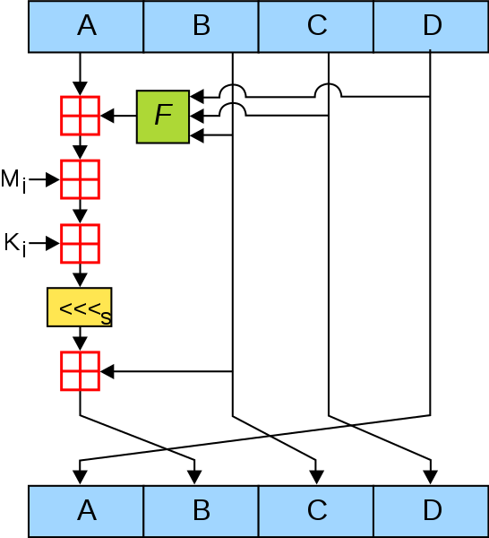
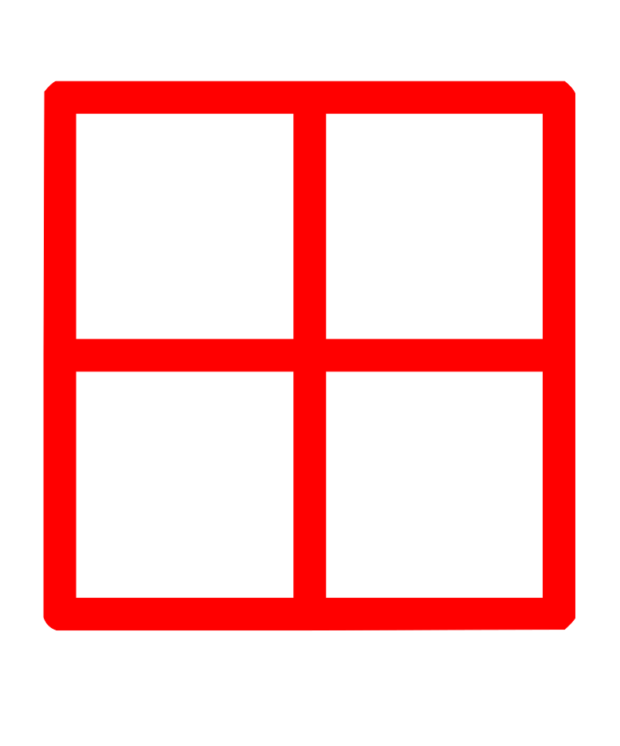
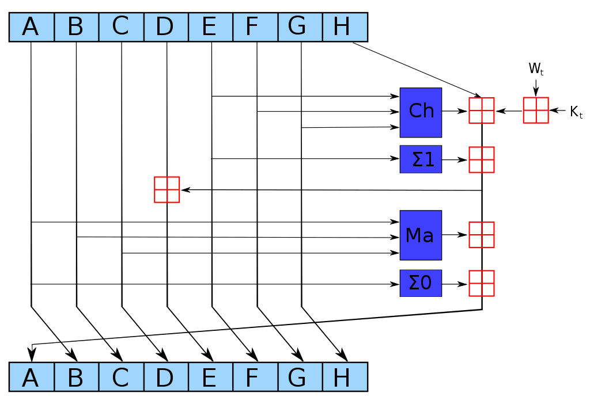

# Hashing

## 해쉬함수의 역할

- 메시지의 무결성 확인
- 디지털 서명

## MD5

- 128비트 암호화 해시 함수.
- 임의의 길이의 입력값을 128비트 값으로 변환.

- 알고리즘

  1. 임의의 길이의 입력값을 512비트의 배수로 패딩.
  2. A, B, C, D 초기화
     - var int h0 := 0x67452301
     - var int h1 := 0xEFCDAB89
     - var int h2 := 0x98BADCFE
     - var int h3 := 0x10325476
  3. 512비트 블록 메시지 처리(4round, 16Step)
     - F - 각 라운드에서 사용하는 비선형 함수
       - F(x, y, z) = (x & y) | (~x & z)
       - G(x, y, z) = (x & y) | (x & ~z)
       - H(x, y, z) = x ^ y ^ z
       - I(x, y, z) = y ^ (x & ~z)
     - Mi - 입력 메시지의 32-비트 블록
     - Ki - 상수
     - <<<s - s칸 만큼의 레프트 로테이션
     -  - 모듈로 2^32 덧셈, (A+B) % 2^32
  4. 512비트 단위로 3을 반복
  5. ABCD가 128비트의 해쉬 값.

- 장점
  - 빨라서 무결성 검사에 유용함.
- 단점
  - 취약점으로 해쉬 충돌을 쉽게 찾을 수 있음.

## SHA

- SHA-0, SHA-1은 이미 취약점이 발견됨, 160bit
- SHA-2 - SHA-224, SHA-256, SHA-384, SHA-512

### SHA-2

- 64 or 80 Rounds

- 
- 
- 
- 
- 
  - 모듈로 덧셈
  - SHA-256 - (A+B) % 2^32
  - SHA-512 - (A+B) % 2^64

## KDF

> **key derivation function (KDF)** is a cryptographic algorithm that derives one or more secret keys from a secret value such as a main key, a password, or a passphrase using a **pseudorandom function**

- DK = KDF(key, salt, iterations)
- DK - the derived key
- KDF - the key derivation function
- key - the original key or password
- salt - a random number which acts as cryptographic salt
- iterations - the number of iterations of a sub-function.

## scrypt

- key derivation function created by Colin Percival in March 2009

- 장점? 목적?
  - 느리다.
  - 비밀번호를 해쉬화 해서 저장하는 데 사용.
    - 빠르면 해쉬 충돌을 쉽게 찾아 공격에 취약함.

## bcrypt

- The input to the bcrypt function is the password string (up to 72 bytes), a numeric cost, and a 16-byte (128-bit) salt value.
- 입력 - 최대 72바이트
- 솔트 - 16바이트

## 출처

- MD5 - <https://ko.wikipedia.org/wiki/MD5>
- SHA-2 - <https://en.wikipedia.org/wiki/SHA-2>
- scrypt - <https://en.wikipedia.org/wiki/Scrypt>
