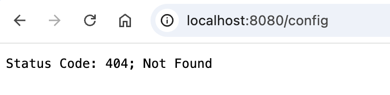
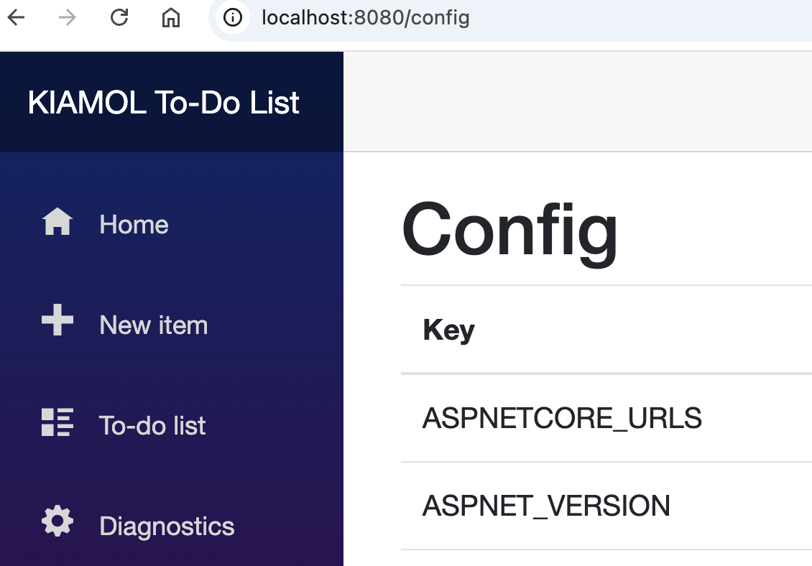
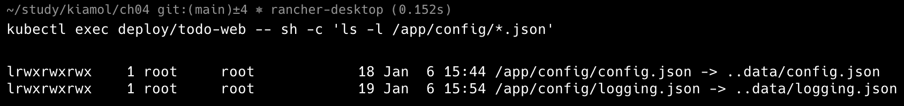
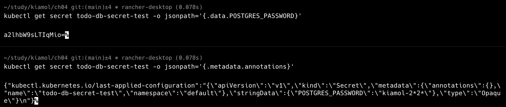

# 컨피그맵과 비밀값

- [1. 요약](#1-요약)
  - [1.1. 설정을 저장하는 리소스](#11-설정을-저장하는-리소스)
  - [1.2. 설정을 전달하는 방법](#12-설정을-전달하는-방법)
- [2. 애플리케이션에 Config 전달 방법들](#2-애플리케이션에-config-전달-방법들)
  - [2.1. 파드 정의에 환경 변수 추가](#21-파드-정의에-환경-변수-추가)
  - [2.2. ConfigMap](#22-configmap)
  - [2.3. Secret](#23-secret)
- [3. 컨피그맵에 저장한 설정 파일 사용](#3-컨피그맵에-저장한-설정-파일-사용)
  - [3.1. 쿠버네티스 설정 전략](#31-쿠버네티스-설정-전략)
  - [3.2. ~~우선순위를 가진 설정값 웹애플리케이션 예제~~](#32-우선순위를-가진-설정값-웹애플리케이션-예제)
- [4. 컨피그맵에 담긴 설정값 데이터 주입](#4-컨피그맵에-담긴-설정값-데이터-주입)
  - [4.1. 데이터를 주입하는 데 필요한 기능](#41-데이터를-주입하는-데-필요한-기능)
  - [4.2. 여러 설정을 하나의 configMap](#42-여러-설정을-하나의-configmap)
  - [4.3. 파드가 동작 중인 상황에서 컨피그맵 업데이트](#43-파드가-동작-중인-상황에서-컨피그맵-업데이트)
  - [4.4. 특정 파일만 마운트하기](#44-특정-파일만-마운트하기)
- [5. Secret을 이용](#5-secret을-이용)
  - [5.1. Secret 정의](#51-secret-정의)
  - [5.2. 비밀값 전달 방법](#52-비밀값-전달-방법)
  - [5.3. 볼륨 마운트로 secret 전달](#53-볼륨-마운트로-secret-전달)
- [6. 쿠퍼네티스의 애플리케이션 설정 관리](#6-쿠퍼네티스의-애플리케이션-설정-관리)
  - [6.1. 애플리케이션의 중단 없이 설정 변경이 필요한가?](#61-애플리케이션의-중단-없이-설정-변경이-필요한가)
  - [6.2. 설정 변경 이력을 남기는 법](#62-설정-변경-이력을-남기는-법)
  - [6.3. 민감 정보를 어떻게 관리할 것인가?](#63-민감-정보를-어떻게-관리할-것인가)

## 1. 요약

### 1.1. 설정을 저장하는 리소스

| 항목          | ConfigMap                                   | Secret                                      |
| ------------- | ------------------------------------------- | ------------------------------------------- |
| 용도          | 애플리케이션의 민감하지 않은 설정 정보 저장 | 민감한 정보(비밀번호, API 키 등) 저장       |
| 저장 방식     | 평문으로 저장                               | Base64로 인코딩된 값으로 저장 (암호화 가능) |
| 사용 예시     | 환경 변수, 설정 파일 등                     | 비밀번호, API 키, 인증서 등                 |
| 데이터 액세스 | kubectl로 쉽게 액세스 가능                  | kubectl로 읽을 수 있지만 디코딩이 필요      |

### 1.2. 설정을 전달하는 방법

| 항목              | 환경 변수                         | 볼륨 마운트                                   |
| ----------------- | --------------------------------- | --------------------------------------------- |
| 용도              | 간단한 설정 값 전달 (주로 문자열) | 큰 데이터나 복잡한 파일을 전달                |
| 크기 제한         | 크기 제한 (수 KB 정도)            | 크기 제한 없음 (큰 데이터 및 파일 가능)       |
| 구성 방식         | YAML에서 env 섹션 사용            | YAML에서 volumeMounts와 volumes 섹션 사용     |
| 데이터 형식       | 주로 키-값 쌍으로 전달 (문자열)   | 파일 형태로 전달 (텍스트, 바이너리 등)        |
| 사용 사례         | 간단한 설정, 작은 값 전달         | 설정 파일, 로그, API 키 등 복잡한 데이터 전달 |
| 애플리케이션 접근 | 코드에서 환경 변수로 직접 접근    | 파일 시스템에서 직접 파일 읽기                |
| 동적 업데이트     | 불가능 Pod 재배치 필요            | 애플리케이션에서 동적으로 업데이트 가능       |
| 보안              | 모든 애플리케이션에서 접근가능    | 파일 권한으로 접근 제어 가능                  |

## 2. 애플리케이션에 Config 전달 방법들

### 2.1. 파드 정의에 환경 변수 추가

- 리소스를 따로 쓰지 않고 환경변수값을 Deployment에 정의

```yaml
# sleep-with-env.yaml
spec:
  containers:
    - name: sleep
      image: kiamol/ch03-sleep
      env: # 환경 변수 정의
        - name: KIAMOL_CHAPTER # 환경 변수 key
          value: "04" # 환경 변수 value
```

```sh
kubectl apply -f sleep/sleep-with-env.yaml
kubectl exec deploy/sleep -- printenv HOSTNAME KIAMOL_CHAPTER
```

> printenv - 환경 변수를 출력하는 리눅스 명령어

- 환경 변수는 파드의 생애 주기내에 불변
- 설정값을 변경하려면 파드를 수정된 버전으로 변경해야함

### 2.2. ConfigMap

- 컨테이너에 설정값을 주입하는 데 쓰이는 리소스
- 파드에서 읽어 들이는 데이터를 저장하는 리소스
- 데이터 형태 - 키-값, 텍스트, 바이너리
- JSON, XML, YAML, TOML, INI 등 설정 파일 지원
- 애플리케이션이 필요한 일반적인 설정 값을 저장
- 파드는 configMap을 읽어 환경 변수 또는 파일의 형태로 컨테이너에 전달
- 하나 이상의 파드에서 ConfigMap에 접근 가능
- 읽기 전용
- 컨피그맵은 읽기 전용

```yaml
env:
  - name: KIAMOL_CHAPTER
    value: "04"
  - name: KIAMOL_SECTION
    valueFrom:
      configMapKeyRef: # configMap에서 Read
        name: sleep-config-literal # configMap Name
        key: kiamol.section # 읽을 항목의 이름
```

```sh
# configMap 생성
kubectl create configmap sleep-config-literal --from-literal=kiamol.section='4.1'
kubectl get cm sleep-config-literal
kubectl apply -f sleep/sleep-with-configMap-env.yaml
kubectl exec deploy/sleep -- sh -c 'printenv | grep "^KIAMOL"'
```

### 2.3. Secret

- 민감한 정보로 클러스터 내부에서 별도로 관리.
- 해당 값을 사용해야하는 노드에만 전달됨.
- 전달 과정과 저장시 **암호화**가 적용됨.
- **base64**로 인코딩됨.

## 3. 컨피그맵에 저장한 설정 파일 사용

- 키=벨류의 텍스트 파일도 환경 파일로 사용 가능

```env
# ch04.env
KIAMOL_CHAPTER=ch04
KIAMOL_SECTION=ch04-4.1
KIAMOL_EXERCISE=try it now
```

```yaml
# sleep-with-configMap-env-file.yaml
env:
- name: KIAMOL_CHAPTER
value: "04"
- name: KIAMOL_SECTION
valueFrom:
    configMapKeyRef:
    name: sleep-config-literal
    key: kiamol.section
envFrom:
- configMapRef:
    name: sleep-config-env-file
```

```sh
kubectl create configmap sleep-config-env-file --from-env-file=sleep/ch04.env
kubectl get cm sleep-config-env-file

kubectl apply -f sleep/sleep-with-configMap-env-file.yaml
kubectl exec deploy/sleep -- sh -c 'printenv | grep "^KIAMOL"'
```

- 환경 변수명이 중복되는 경우 **env** 항목에서 정의된 값이 envFrom 보다 우선한다

### 3.1. 쿠버네티스 설정 전략

- 기본값은 컨테이너 이미지에 포함
  - e.g. 모든 환경의 공통 값 or 모든 환경값을 넣고 dev 환경으로 동작
- 각 환경의 실제 설정값은 configMap에 담겨 컨테이너의 파일 시스템에 전달
- 변경이 필요한 설정값은 deployment 내 pod 정의에서 환경 변수 형태로 적용

### 3.2. ~~우선순위를 가진 설정값 웹애플리케이션 예제~~

- 기본값 - 도커 이미지에 포함된 JSON
- 설정값 - 설정파일이 발견되면 기본값을 덮어씀

```yaml
# todo-web-dev.yaml
spec:
  containers:
    - name: web
      image: kiamol/ch04-todo-list
      env:
        - name: Logging__LogLevel__Default
          value: Warning
```

```sh
kubectl apply -f todo-list/todo-web.yaml
```

- localhost:8080/config 접근시 에러
  

```yaml
# todo-web-config-dev.yaml
apiVersion: v1
kind: ConfigMap # 리소스 유형: configMap
metadata:
  name: todo-web-config-dev # configMap Name
data:
  config.json: |- # key-value의 key가 파일명
    {                           # 파일 내용의 포멧은 자유
      "ConfigController": {
        "Enabled" : true
      }
    }
```

```sh
kubectl apply -f todo-list/configMaps/todo-web-config-dev.yaml
kubectl apply -f todo-list/todo-web-dev.yaml
```

- ConfigController 설정이 활성화 되어 localhost:8080/config 에 접근 가능
  

- configMap에 내용 포함 - apply 명령만으로 쉽게 배치 가능
- 다른 파일에 내용 있음 - create로 해당리소스를 먼저 배치 후 apply 해야 함

## 4. 컨피그맵에 담긴 설정값 데이터 주입


- 환경 변수 외에 설정값 전달 방법 - 컨테이너 파일 시스템 속 파일로 설정값 주입
- 컨테이너 파일 시스템은 컨테이너 이미지와 그외 출처에서 온 파일로 구성

### 4.1. 데이터를 주입하는 데 필요한 기능

- configMap에 담긴 데이터를 파드로 전달하는 **Volume** 생성
- configMap을 읽어 들인 볼륨을 파드 컨테이너의 특정 경로에 **Volume Mount**

```yaml
spec:
    containers:
    - name: web
        image: kiamol/ch04-todo-list
        volumeMounts:
        - name: config                  # 마운트할 volume name
            mountPath: "/app/config"    # 마운트 경로
            readOnly: true              # 읽기 전용
    volumes:
    - name: config                      # volume name
        configMap:                      # volume의 원본
        name: todo-web-config-dev       # configMap name
```

### 4.2. 여러 설정을 하나의 configMap

```yaml
# todo-web-config-dev-with-logging.yaml
data:
  config.json: |-
    {
      "ConfigController": {
        "Enabled" : true
      }
    }
  logging.json: |-
    {
      "Logging": {
        "LogLevel": {
          "ToDoList.Pages" : "Debug"
        }
      }
    }
```

```sh
kubectl apply -f todo-list/configMaps/todo-web-config-dev-with-logging.yaml
```



### 4.3. 파드가 동작 중인 상황에서 컨피그맵 업데이트

- 쿠버네티스는 수정된 파일을 컨테이너에 전달
- 이후는 어플리케이션의 재량
- 어플리케이션은 파일 변화를 감지하고 설정에 반영 해야함

### 4.4. 특정 파일만 마운트하기

> 볼륨 마운트시 주의사항
>
> - 이미 존재하는 경로라면 디렉토리를 모두 덮어씀. 기존 파일이 삭제됨.

```yaml
spec:
    containers:
    - name: web
        image: kiamol/ch04-todo-list
        volumeMounts:
        - name: config
            mountPath: "/app/config"
            readOnly: true
    volumes:
    - name: config
        configMap:
        name: todo-web-config-dev
        items:
        - key: config.json
            path: config.json
```

## 5. Secret을 이용

- configMap은 텍스트 파일을 단순히 추상화한 객체로 보안이 없음.
- secret
  - 민감한 정보로 클러스터 내부에서 별도로 관리.
  - 해당 값을 사용해야하는 노드에만 전달됨.
  - 전달 과정과 저장시 **암호화**가 적용됨.
  - **base64**로 인코딩됨. (우연한 평문 노출 방지)

```yaml
spec:
    containers:
    - name: sleep
        image: kiamol/ch03-sleep
        env:
        - name: KIAMOL_SECRET
        valueFrom:
            secretKeyRef:
            name: sleep-secret-literal
            key: secret
```

```sh
kubectl create secret generic sleep-secret-literal --from-literal=secret=shh...
kubectl get secret sleep-secret-literal -o jsonpath='{.data.secret}' | base64 -d
```

- 애플리케이션 정의에서 환경 변수로 읽을 수 있음.

```sh
kubectl apply -f sleep/sleep-with-secret.yaml
kubectl exec deploy/sleep -- printenv KIAMOL_SECRET
```

> 환경 변수는 컨테이너 내의 모든 프로세스가 접근 가능하므로 주의가 필요
> 비밀값을 파일 형태로 전달해서 파일 권한으로 제어 가능

### 5.1. Secret 정의

```yaml
apiVersion: v1
kind: Secret
metadata:
  name: todo-db-secret-test
type: Opaque
stringData:
  POSTGRES_PASSWORD: "kiamol-2*2*"
```

```sh
kubectl apply -f todo-list/secrets/todo-db-secret-test.yaml
kubectl get secret todo-db-secret-test -o jsonpath='{.data.POSTGRES_PASSWORD}'
kubectl get secret todo-db-secret-test -o jsonpath='{.metadata.annotations}'
```



- Secret은 base64로 인코딩됨 하지만 annotations에는 평문으로 보임

- 운영 환경의 민감한 데이터를 YAML에 포함하면 안됨.
- 민감한데이터가 들어갈 자리를 표시 후 애플리케이션을 배치할 때 추가적인 처리
  - e.g. 깃허브 시크릿 기능에 저장된 값을 채움.

> 쿠버네티스 클러스터에 들어간 비밀값은 권한 있는 사람은 누구나 볼 수 있는 상태

### 5.2. 비밀값 전달 방법

- 환경 변수에 비밀값 저장
- 환경 변수에 파일 패스를 지정 후 파일을 읽기

### 5.3. 볼륨 마운트로 secret 전달

```yaml
spec:
  containers:
    - name: db
      image: postgres:11.6-alpine
      env:
        - name: POSTGRES_PASSWORD_FILE
          value: /secrets/postgres_password
      volumeMounts:
        - name: secret
          mountPath: "/secrets"
  volumes:
    - name: secret
      secret: # 비밀값으로 볼륨 생성
        secretName: todo-db-secret-test
        defaultMode: 0400 # 파일 권한
        items:
          - key: POSTGRES_PASSWORD
            path: postgres_password
```

```sh
kubectl apply -f todo-list/todo-db-test.yaml
kubectl logs -l app=todo-db --tail 1
kubectl exec deploy/todo-db -- sh -c 'ls -l $(readlink -f /secrets/postgres_password)'
```

## 6. 쿠퍼네티스의 애플리케이션 설정 관리

### 6.1. 애플리케이션의 중단 없이 설정 변경이 필요한가?

- 환경 변수는 파드 교체가 필요함. 애플리케이션이 중단됨
- 애플리케이션 무중단을 위해서는 볼륨 마운트로 설정 파일 교체가 필요.

### 6.2. 설정 변경 이력을 남기는 법

- 설정 객체의 이름에 버전을 넣음.
- 파드 교체로 새 버전의 설정을 로드.
- 파드 교체가 필수

### 6.3. 민감 정보를 어떻게 관리할 것인가?

- YAML 템플릿 파일에는 실제 민감 정보 대신 해당 정보가 채워질 빈칸을 둠.
- 배치 절차 중에 이 빈칸을 Vault의 값으로 채움.
