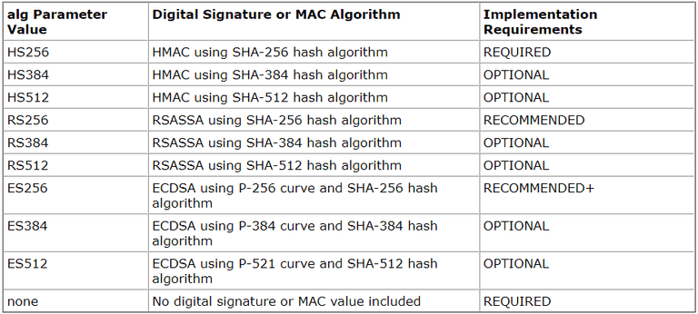
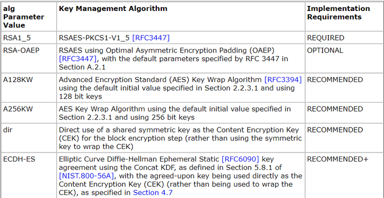
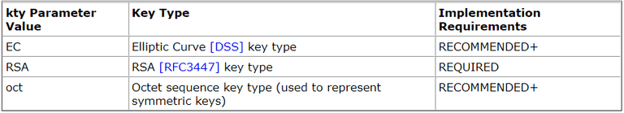

# JWT

- [1. JOSE](#1-jose)
- [2. JWT](#2-jwt)
  - [2.1. JWS](#21-jws)
  - [2.2. JWE](#22-jwe)
- [3. JWK](#3-jwk)
- [4. JWA](#4-jwa)
- [5. 참고 자료](#5-참고-자료)

## 1. JOSE

- JOSE - JSON Object Signing and Encryption
- 암호화 및 서명을 JSON으로 표현하기 위한 기술 집합
- JWS, JWE, JWK, JWA가 포함

## 2. JWT

- JSON Web Token
- JSON을 웹 토큰으로 사용하기는 기술 표준
- JWS와 JWE로 나뉨
- claim에 아래의 값을 표함
  - iss - issuer 키 발급자
  - sub - subject 주제

### 2.1. JWS

- 우리가 흔히 생각하는 JWT
- header, payload, signature로 구성
- Base64Url로 인코딩 되어 있음.

- 구성

  - Header에는 반드시 alg을 표기해야 함.
  - Payload - claim이 들어 있는 본문.
  - Signature - payload의 내용을 signature로 변조를 여부를 판단.

- 대표 알고리즘 - HS256, RS256

### 2.2. JWE

- 내용을 암호화해서 토큰으로 사용하는 방식

- 구성
  - JOSE header
    - alg - CEK를 암호화한 알고리즘. eg. RSA-OAEP
    - enc - 본문을 CEK로 암호화한 알고리즘. eg. A128CBC-HS256(AES128)
  - JWE Encrypted Key - Content Encryption Key(CEK). 임의의 키.
  - JWE initialization vector - 초기 백터.
  - JWE Ciphertext - 암호문.
  - JWE Authentication Tag - 암호문의 무결성 보장.

## 3. JWK

- 공개키를 JSON형태로 나타 낸 것

```json
{
"alg":"RSA",

"mod": "0vx7agoebGcQSuuPiLJXZptN9nndrQmbXEps2aiAFbWhM78LhWx4cbbfAAtVT86zwu1RK7aPFFxuhDR1L6tSoc_BJECPebWKRXjBZCiFV4n3oknjhMs
tn64tZ_2W-5JsGY4Hc5n9yBXArwl93lqt7_RN5w6Cf0h4QyQ5v-65YGjQR0_FDW2QvzqY368QQMicAtaSqzs8KJZgnYb9c7d0zgdAZHzu6qMQvRL5hajrn1n91CbOpbI
SD08qNLyrdkt-bFTWhAI4vMQFh6WeZu0fM4lFd2NcRwr3XPksINHaQ-G_xBniIqbw0Ls1jF44-csFCur-kEgU8awapJzKnqDKgw",

"exp":"AQAB",

"kid":"2011-04-29"
}
```

- JWK sets - 여러 JWK의 묶음, kid로 구분.

## 4. JWA

- JSOE에 쓰이는 알고리즘들.

- JWS

  

- JWE

  

- JWK로 표현 가능한 키

  

---

## 5. 참고 자료

- What are JWT, JWS, JWE, JWK, and JWA? - https://www.loginradius.com/blog/engineering/guest-post/what-are-jwt-jws-jwe-jwk-jwa/
- JWS - https://www.rfc-editor.org/rfc/rfc7515
- JWE - https://www.rfc-editor.org/rfc/rfc7516
- JWK - https://www.rfc-editor.org/rfc/rfc7517
