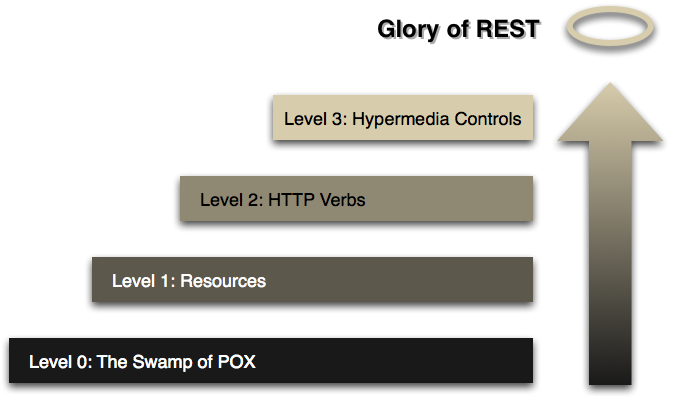

# RESTful API

- [1. REST](#1-rest)
  - [1.1. REST 아키텍처 6가지 제한](#11-rest-아키텍처-6가지-제한)
  - [1.2. Uniform Interface](#12-uniform-interface)
  - [1.3. URI 세부 규칙](#13-uri-세부-규칙)
- [2. glory of REST](#2-glory-of-rest)
- [출처](#출처)

## 1. REST

- Representational state transfer
- 네트워크 아키텍처 원리 - 자원을 정의하고 자원에 대한 주소를 지정하는 방법 전반

- RESTful API - REST를 준수하는 웹 API의 별칭.

### 1.1. REST 아키텍처 6가지 제한

- 클라이언트/서버 구조

  - 관심사 분리. UI와 데이터 저장을 분리.
  - 독립적으로 발전 가능.

- 무상태

  - 콘텍스트(세션)를 저장하지 않음
  - 상태 저장에 리소스를 쓰지 않으므로 대용량 시스템에 적합.

- 캐시 처리 가능

  - 클라이언트는 응답을 캐싱 할 수 있어야 함.

- 계층화

  - 클라이언트는 서버에 직접 연결 되었는지 중간 서버를 통해 연결 되었는 지 알 수 없음.
  - 중간 서버는 로드 벨런싱, 공유 캐시 기능을 제공하여 시스템 확장성을 향상.

- Code on Demand(선택 사항)

  - 서버는 실행 코드(자바 애플릿, 자바스크립트)를 전송하여 클라이언트의 기능을 일시적으로 확장.

- **인터페이스의 일관성**

### 1.2. Uniform Interface

- 자원의 식별
  - 요청의 개별 자원을 URI로 식별
- 표현을 통한 리소스의 조작
  - 클라이언트가 메타데이터와 리소스의 표현을 가지고 리소스의 상태를 수정 할 수 있음.
- 자기기술적 메시지
  - 메시지가 어떤 작업을 해야하는지 충분히 표현을 해야함.
- Hypermedia as the engine of application state (HATEOAS)
  - 애플리케이션의 상태는 하이퍼링크를 이용해 전이되어야 함.
  - 클라이언트가 전적으로 서버와 동적인 상호작용이 가능하도록 하는 것
  - 요청에 필요한 URI를 응답에 포함시켜 반환
  - 클라이언트와 서버가 독립적으로 진화 하기 위해서.
    - 다음 페이지의 주소가 변경되어도 클라이언트 소스는 변경될 필요 없음.
  - eg. 게시판 목록 응답에 이전, 다음 페이지의 URI를 응답에 포함해야 함.
  - eg. 웹 사이트는 HATEOAS를 만족함.

### 1.3. URI 세부 규칙

- /(슬래시) - 계층을 표현
- 마지막에는 /를 넣지 않음.
- -(하이픈) - 가독성을 위해 사용.
- \_(언더바) - 사용 금지
- URI는 소문자로 표기
- 확장자는 표기 하지 않음. - Accepth Header에 표현
- 리소스간 연관 관계가 있는 경우
  - 일반적으로 소유 관계를 표현
  - eg. GET: /users/2/orders - 유저2의 주문.

## 2. glory of REST



- Level 0

  - 웹 메커니즘을 사용하지 않은 API
  - 다른 매개변수를 통해서 하나의 endpoint로 여러 동작
  - eg. POST으로 CRUD 요청

  ```http
  CREATE : POST /api/userService
  READ   : POST /api/userService
  UPDATE : POST /api/userService
  DELETE : POST /api/userService
  ```

- Level 1 - Resources

  - 분할 정복을 사용하여 복잡한 처리 문제를 해결하고 대규모 서비스 엔드포인트를 여러 리소스로 나눕
  - 개별 리소스와 통신
  - 리소스 별로 고유한 URI를 사용.

  ```txt
  CREATE : POST /api/users/create
  READ   : GET /api/users/1
  UPDATE : POST /api/users/update
  DELETE : POST /api/users/remove/1
  ```

- Level 2 - HTTP Verbs

  - 표준 동사 세트를 도입하여 유사한 상황을 동일한 방식으로 처리하여 불필요한 변형을 제거
  - GET은 안전한 작업, 상태를 변경 시키지 않는 작업, 읽기, 매번 결과가 같음(캐쉬 가능).
    > REST와 CRUD는 관계가 없다. HTTP 메서드를 지켜야 할 뿐.

  ```txt
  CREATE : POST /api/users
  READ   : GET /api/users/1
  UPDATE : PUT /api/users/1
  DELETE : DELETE /api/users/1
  ```

- Level 3 - Hypermedia Controls

  - 프로토콜을 자체 문서화하는 방법
  - 응답에 가능한 행위와 URI를 반환.

  > 사실 다음 동작에 대해 또 하나의 명세를 만들어야 함. 힘듬.

  ```http
  GET /doctors/mjones/slots?date=20100104&status=open HTTP/1.1
  Host: royalhope.nhs.uk
  ```

  - 20100104 날에 mjones 의사의 비어있는 슬롯을 요청.

  ```http
  HTTP/1.1 200 OK
  [various headers]

  <openSlotList>
  <slot id = "1234" doctor = "mjones" start = "1400" end = "1450">
      <link rel = "/linkrels/slot/book"
          uri = "/slots/1234"/>
  </slot>
  <slot id = "5678" doctor = "mjones" start = "1600" end = "1650">
      <link rel = "/linkrels/slot/book"
          uri = "/slots/5678"/>
  </slot>
  </openSlotList>
  ```

  - 비어있는 슬롯 리스트를 반환.
  - 예약하려면 이동해야 할 주소를 반환.

> 진짜 REST API는 거의 없다.  
> 어느 정도 REST API를 준수하는 것.

---

## 출처

- Day1, 2-2. 그런 REST API로 괜찮은가 - <https://www.youtube.com/watch?v=RP_f5dMoHFc>
- Representational state transfer - <https://en.wikipedia.org/wiki/Representational_state_transfer>
- steps toward the glory of REST - <https://martinfowler.com/articles/richardsonMaturityModel.html>
- REST API 성숙도 모델 (Maturity Model) - <https://velog.io/@younge/REST-API-성숙도-모델-Maturity-Model-eqqyjqff>
- RESTful API 이란 - <https://velog.io/@somday/RESTful-API-이란>
