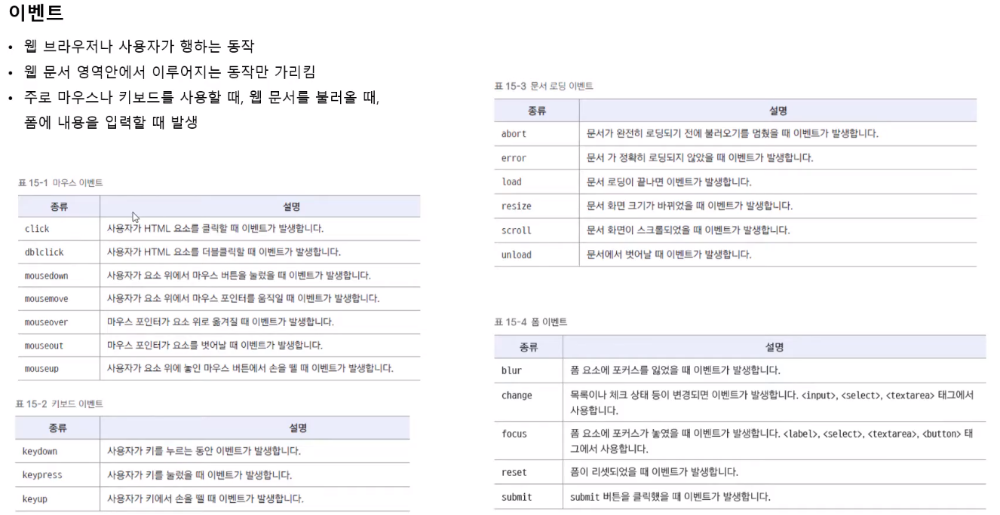
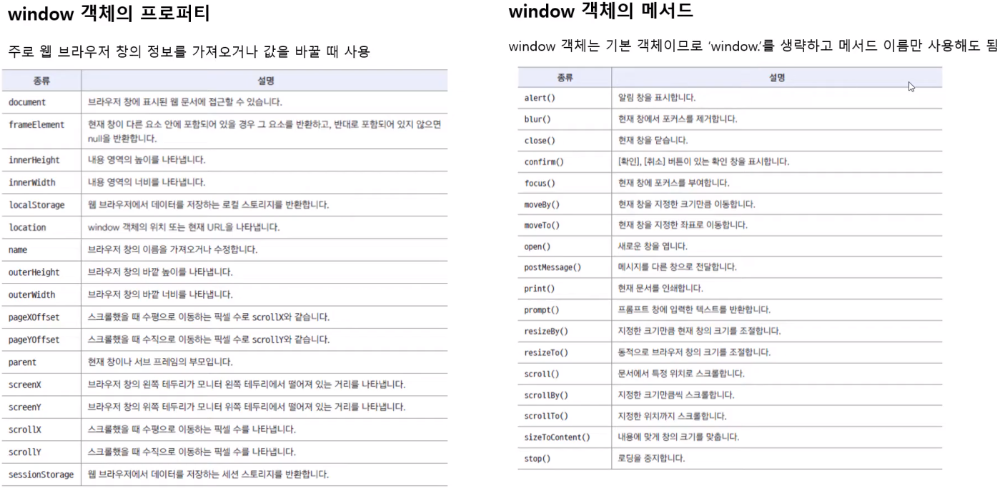

# Frontend 기초

## 0. html, css, javascrpit

- html

웹 문서의 뼈대

내용을 보여주기 위한 것

- css

웹 문서를 꾸며주는 것. 내용과 디자인을 분리.

반응형 웹 디자인에 필수 적임.

- javascrpit

사용자 동작에 반응하는 페이지

## 1. html

```html
<!DOCTYPE html>
<!-- HTML5언어로 작성한 문서라는 뜻 -->
<html lang="ko">
  <!-- HTML 시작, 한글 문서 -->
  <head>
    <!-- 헤더, 문서해석에 필요한 정보 -->
    <meta charset="UTF-8" />
    <!-- 메타, 문서 정보 표기, 문자셋 UTF-8 -->
    <title>웹 개발 입문</title>
    <!-- 문서의 제목 -->
  </head>
  <body>
    <!-- 바디, 실제내용 -->
    <h1>웹 개발 기초</h1>
    <p>HTML</p>
    <p>CSS</p>
    <p>자바스크립트</p>
  </body>
</html>
<!--HTML 끝, 한글 문서-->
```

```html
<h1>가장 큰 제목</h1>
<h6>가장 작은 제목</h6>
<em>기울기</em>
<b>진하게</b>
<strong>강조</strong>
<hr />
<!-- 가로 선 -->
```

이미지

```html

```

오디오, 비디오

```html
<audio src="medias/test.mp3" controls></audio>
<video src="medias/test.mp4" controls width="600"></video>
```

| 속성            | 설명                                                                             |
| --------------- | -------------------------------------------------------------------------------- |
| controls        | 컨트롤 바 표시                                                                   |
| autoplay        | 자동 재생 (크롬이나 모바일에서는 안됨,단 muted하면 됨)                           |
| muted           | 음소거 상태                                                                      |
| loop            | 반복 재생                                                                        |
| preload         | 페이지 불러 올때 어떻게 로딩할 것인가?, auto,metadata,none로 설정, auto가 디폴트 |
| width, hegith   | 너비, 높이 지정                                                                  |
| poster="파일명" | video가 재생 되기 전의 이미지, 썸네일                                            |

링크하기

```html
<a herf="파일명">내용</a>
<!-- 문자에 링크 -->
<a herf="파일명"></a>
<!-- 그림에 링크 -->
<a herf="파일명" target="_blank">내용</a>
<!-- 새 탭에 열기 -->
```

폼만들기

```html
<form action="register.php">
  <!-- 폼을 보낼 곳, 처리할 곳-->
  <label for="user-id">아이디 : </label>
  <input type="text" id="user-id" />
  <!-- label로 필드와 명칭을 묶을 수 있다.-->
  <label>비밀번호 : <input type="password" /></label>
  <input type="submit" value="로그인" />
</form>
```

그외 다양한 입력 폼은 form.html 참조

### tag 속성 지원 브라우저 확인 사이트

caniuse.com

## 2. CSS

여러 곳에서 일괄적인 스타일 적용

```css
/* 전체 선택자 */
* {
  margin: 0;
  padding: 0;
}

/* 타입 선택자, 태그 선택자 */
h1 {
  /* 선택자 */
  color: blue; /* 속성:속성값 */
}

/* class 선택자, 여러번 사용가능*/
.redtext {
  /*.으로 시작함 */
  color: red;
}

/* id선택자, 한번만 사용가능, 유일한 속성으로 지정 */
#container {
  border: 1px solid #222;
  padding: 10px;
}
/* 여러번 사용한다고 해서 문제가 있지는 않음. */
```

### CSS 우선순위

캐스케이딩(cascading) : 위에서 아래로 흐른다. 계단식으로 적용

선택자에 여러 스타일이 적용될 때 스타일 충돌을 막기 위해서 우선순위에 따라 스타일 결정

- 우선순위 - 중요도와 적용 범위에 따라 우선순위 결정, 위에서 아래로 적용
- 상속 - 부모요소의 스타일을 자식요소에 전달, 위에서 아래로 적용

#### 우선순위

1. 우선순위
   사용자 스타일 - 시스템에서 만든 스타일, 사용자가 제어 불가
   제작자 스타일 - CSS파일에 제작자가 만든 스타일
   브라우저 스타일 - 아무도 지정하지 않았을 때 스타일

2. 얼마나 한정하는가

   1. !important - 가장 우선 되는 스타일
   2. 인라인 스타일
   3. id 스타일
   4. 클래스 스타일
   5. 타입 스타일

3. 중요도와 명시도가 같다면 소스 선언 순서에 따라 나중에 온 스타일이 덮어씀.

#### 상속

자식요소를 별도로 지정하지 않으면, 부모 속성을 사용함.  
e.g. body에 선언한 속성이 p에도 적용됨.

단, 모든 속성이 상속되는 것은 아님. (e.g. 배경색)

### 속성들

#### 글자 속성

| 종류        | 속성        |
| ----------- | ----------- |
| font-family | 글꼴 종류   |
| font-size   | 글자 크기   |
| font-style  | 이텔릭체 등 |
| font-weight | 글자 굵기   |

font-family: 바탕;
pc에 있는 폰트를 지정해주거나,
웹폰트를 사용하거나,
폰트 다운로드를 지원해야 제대로 출력 됨.

웹폰트를 많이 쓰면 사이트가 느림.

구글 폰트 fonts.google.com

폰트를 고르고 임포트문을 복사함.

```css
<style>
  @import url("https://fonts.googleapis.com/css2?family=Nanum+Pen+Script&display=swap");
  h1 {
    font-family: 'Nanum Pen Script', 바탕;
  }
</style>
```

첫번째 글꼴이 실패하면 두번째 글꼴이 사용됨

font-size: 3em;
대문자M 사이즈 기준  
상위 요소의 100분율크기  
1em = 100%

font-weight:400;
폰트 굵기, 400이 기본적 굵기, 700정도면 굵게와 비슷

color

글자 색 지정

1. 색상 이름 표기법
   - 기본색상 16가지
   - 웹 안전 색상(web-safe color)
     - 모든 브라우저에서 표현 할 수 있는 색상
   - 200 + 16 = 총 216가지 색
2. 16진수 표기법
   - #000000(검) ~ #ffffff(흰) - 6자리 16진수
   - 2자리씩 빨강, 초록, 파랑
   - 축약가능 #ffcc00 = #fc0
3. hsl/hsla
   - hsla(240,100%,50%,03)
   - 색상(hue), 채도(saturation), 밝기(light)
   - 마지막에 투명도(알파값) 추가 가능(0(투명) ~ 1(불투명))
   - hsla(240,100%,50%,03)
4. rgb/rgba 표기법
   - color:rgb(255,0,0)
   - 세자리 숫자로 표현
   - 빨강, 초록, 파랑
   - 없으면 0, 최대값 255
   - 알파값 추가 가능 (0 ~ 1)
   - color:rgba(255,0,0,3)

text 속성
정렬 - text-align: right;

줄간격 - line-height: 2; 폰트의 2배

취소선
text-decoration: line-through;
text-decoration: none; // 선 제거

그림자
text-shadow:5px 4px 3px #222;
오른쪽으로 5px, 밑으로 4px, 번짐 3px, 색상 디폴트는 글자색과 같음.

리스트 스타일
list-style-type: none;
리스트의 마크를 지움. 기본값은 disk
list-style-type: upper-alpha;
순서 리스트를 알파벳 대문자로 바꿈

테이블 스타일

```css
table {
  caption-side: bottom; /* 표 캡션 위치, 기본 top */
  border: 1px solid black; /* 표 테두리는 검은 색 실선으로 */
  border-collapse: collapse; /* 테두리 한겹. 기본 두겹 */
}
td,
th {
  border: 1px dotted black; /* 셀 테두리는 검은 색 점선으로 */
  padding: 10px; /* 셀 테두리와 내용 사이의 여백 */
  text-align: center; /* 셀 내용 가운데 정렬 */
}
th {
  background-color: #ccc;
}
```

### CSS 박스 모델

- 블록 레벨 요소

  한구역을 차지 함

  ```html
  <p></p>
  ```

- 인라인 레벨 요소

  일부분을 차지함

  ```html
  <span></span>
  ```


콘덴츠 영역을 둘러 쌓는 여백

- 마진 - 박스 모델 사이의 여백
- 보더 - 테두리 굵기
- 패딩 - 콘덴츠와 테두리 사이의 여백

박스 모델 값 지정

한번에 지정할때 top->right->bottom->left(시계방향으로) 지정

테두리

border-style
기본 값 none
가장 먼저 지정해줘야 함.

border-witdh - 너비

```css
#box1 {
  border-width: 2px; /* 상우하좌 모두 2px */
  border-width: thick thin; /* 상굵 우얇 하굵 좌얇, 즉, 상하 굵게, 좌우 얇게  */
  border-width: 10px 5px 5px 2px; /* 상10 우5 하5 좌2*/
}
```

border 색상

```css
#box1 {
  border-color: red;
  border-top-color: blue; /* 위에 테두리만 파란색 */
}
```

border 속성 한번에 묶어서 지정하기

```css
#box1 {
  border: 3px solid blue; /*모든 테두리 3px, 실선, 파란색*/
  border-bottom: 3px dotted black; /*밑 테두리 3px, 점선, 검은색*/
}
```

border 모서리 둥글게

반지름
border-radius: 10px;
너비와 높이의 각각 비중
border-radius: 10%;

박스 모델의 여백

마진, 패딩

마진 중첩

요소가 **세로**로 겹칠경우

둘다 여백이 생기는게 아니라, 큰 것만 살아 남음


### 웹 문서 레이아웃

display

display : block; -블럭요소로  
display : inline-block; 형태는 인라인으로 각 요소는 블럭으로

float - 떠있게 함

응용 - 3단 레이아웃


[3column.html](3column.html) 참조

[30column.css](css/3column.css) 참조

위치 설정
top, right, bottom, left 브라우저에서 얼마나 떨어져있나

- position: static - 기본값, 소스가 나열 된 순서대로
- position: relative - 이전 요소와의 상대 위치
- position: fixed - 브라우저 기준 항상 고정
- position: absolute - 상위 요소 중 relative라고 설정된 것으로부터 고정.

[position.html](position.html) 참조

### 이미지와 그라데이션 배경

```css
body {
  background-color: lightcyan;
  /* 자동으로 반복으로 가득 참 */
  background-image: url(images/healing.jpg);
  background-repeat: repeat-x;
  background-position: bottom;
  /* 배경 위치 고정*/
  background-attachment: fixed;
}
```

```css
body {
  /* 한번에 쓰기 */
  background: url(images/bg2.png) no-repeat top right fixed;
}
```

배경 이미지크기

```css
/* 기본값 */
background-size: auto;
/* 너비 높이 지정 */
background-size: 200px 400px;
/* 너비값만 지정 */
background-size: 200px;
/* 퍼센트 지정*/
background-size: 80%;

/* 영역에 크기 맞추기, 그림이 잘리지 않음. */
background-size: contain;
/* 빈공간 없게 꽉채우기, 그림이 잘림 */
background-size: cover;
```

backgorund-size:auto; - 기본값, 원래 크기

그라데이션

```css
div {
  width: 800px;
  height: 400px;
  border: 1px solid #222;
  border-radius: 10px;
}
.grad {
  background: #06f; /* css3를 지원하지 않는 브라우저용 */

  background: linear-gradient(120deg, white 30%, skyblue 60%, blue);
}
/* 타원 그라데이션 */
.grad1 {
  background: radial-gradient(white, yellow, red);
}
/* 원형 그라데이션 */
.grad2 {
  background: radial-gradient(circle at 20% 20%, white, yellow, red);
}
```

원형 그라데이션 속성


### CSS 고급 선택자

1. 연결 선택자

   ```css
   /* 연결 선택자, 모든 하위 요소 모두에 영향 */
   section p {
     background-color: white;
     color: blue; /* 글자색을 파란색으로 */
   }
   /* 자식 선택자 > 자식 요소에만 영향, 손자 영향 X */
   section > p {
     background-color: white;
     color: green;
   }
   /* 형제 선택자 ~ 같은 레벨의 태그 전부*/
   h1 ~ p {
     background-color: gray;
     color: white;
   }
   /* 인접형제 선택자 + 같은 레벨의 태그 중 첫 번째 것*/
   h1 + p {
     background-color: #222;
     color: white;
   }
   ```

2. 속성 선택자

   ```css
   a[href] {
     background: yellow;
     border: 1px solid #ccc;
     font-weight: normal;
   }
   ```

   | 종류          | 선택요소                                  | 예시              |
   | ------------- | ----------------------------------------- | ----------------- |
   | [속성]        | 해당 속성이 있는 요소                     | [href]            |
   | [속성=값]     | 속성 값이 있는 요소                       | [target=_black]   |
   | [속성 ~= 값]  | 속성값이 포함된 요소(단어별)              | [class ~= button] |
   | [속성 \|= 값] | 속성값이 포함된 요소(하이픈 포함, 단어별) | [title \| = us]   |
   | [속성 ^= 값]  | 속성값으로 시작되는 요소                  | [title ^= eng]    |
   | [속성 %= 값]  | 속성값으로 끝나는 요소                    | [herf $= xls]     |
   | [속성 *= 값]  | 속성값의 일부가 일치하는 요소             | [herf *= w3]      |

3. 가상 클래스 선택자

- 가상클래스
  CSS pseudo-class 는 선택될 요소(element)의 특별한 상태를 지정하는 선택자(selector)에 추가된 키워드입니다. 예를 들어 :hover는 사용자가 선택자에 의해 지정된 요소 위를 맴돌(hover) 때 스타일을 적용

  링크와 관련된 가상의 상태를 표현하는 것

  | 표기     | 설명               |
  | -------- | ------------------ |
  | :link    | 방문전 링크        |
  | :visited | 방문후 링크        |
  | :active  | 마우스를 클릭시    |
  | :hover   | 마우스를 올렸을 때 |

  위의 순서대로 정의해야 오류가 없음.

  - :focus - 탭으로 선택했을시

- 가상 요소
  html에는 태그로 존재 하지 않지만, 디자인 하기 위한 요소

  가상 요소(pseudo-element)는 선택자(selector)에 추가되지만 특별한 상태를 기술하는 대신, 문서의 특정 부분을 스타일할 수 있습니다. 예를 들어, ::first-line 가상 요소는 선택자에 의해 지정된 요소의 첫 줄만을 대상으로 합니다.

  | 표기     | 설명             |
  | -------- | ---------------- |
  | ::after  | 요소 뒤에 추가됨 |
  | ::before | 요소 앞에 추가됨 |

### 트랜지션, 트랜스폼

- 트랜스폼

  - 2차원 변형

    - transform: translate(오른쪽으로, 밑으로); - px,%,em단위로 이동
    - transform: scale(2) - 배율
    - transform: rotate(40deg) - 시계 방향
    - trnasform: skew(x, y) - 각도 비틀기

  - 3차원 변형
    - perspective : 200px - 깊이감 표시, 적용하려는 요소, 부모요소에 정의해줘야함.
    - transform: translate3d(x,y,z) - 3차원 이동
    - transform: rotateX()

- 트랜지션
  서서히 변하게해서 애니메이션처럼 보이게 함.

  ```css
  transition-property: width, height; /* 트랜지션 대상 지정 - 너비, 높이 */
  transition-property: all; /* 트랜지션 대상 지정 - 모두 */
  transition-duration: 2s, 1s; /* 트랜지션 시간 - 2초, 1초 */
  transition-deley: 1s; /* 지정 시간 후에 트랜지션 시작 */
  transition-timing-function: ease; /* 변화 속도. 기본값*/
  transition: (all) 실행시간 (딜레이) 타이밍펑션;
  ```

  [transition](transition.html) 참조

### 애니메이션

키프레임을 지정하고 이를 연결하여 애니메이션을 만듬.

[animation](animation.html) 참조

### 반응형 웹 디자인과 미디어 쿼리

화면 크기에 따라 변하는 웹디자인

viewprot - 실제 내용이 표시되는 영역

```css
<meta name="viewport" content="width-device-width, initial-scale=1">
```

- vw(viewport width) : 1vw는 뷰포트 너비값의 1%
- vh(viewport height) : 1vh는 뷰포트 높이값의 1%
- vmin(viewport mininum) : 뷰포트의 너비와 높이중에서 작은 값의 1%
- vmax(viewport maximum) : 뷰포트의 너비와 높이중에서 큰 값의 1%

미디어 쿼리

접속하는 장치에 따라 특정한 CSS스타일을 적용

@media[only|not]미디어 유형[and 조건]\*[and 조건]

only : 미디어 쿼리를 지원하지 않는 브라우저, 미디어쿼리 실행안함, 요즘은 다 지원함
not : not 다음에 오는 비디어 유형은 제외함. not tv라고 하면 TV 제외 적용
and : 복수 조건

```css
@media screen and(min-width:768px) and (max-width: 1439px) {
  /* 생략 */
}
```

| 종류   | 설명                  |
| ------ | --------------------- |
| all    | 모든 유형             |
| print  | 인쇄 장치             |
| screen | pc화면, 스마트폰 화면 |

등등

웹문서 뷰포트 (가장많이 쓰는 속성)

| 종류                  | 설명              |
| --------------------- | ----------------- |
| width, height         | 가로, 세로        |
| min-width, min-height | 가로, 세로 최솟값 |
| max-width, max-height | 가로, 세로 최댓값 |

디바이스 뷰포트

| 종류                                | 설명              |
| ----------------------------------- | ----------------- |
| device-width, device-height         | 가로, 세로        |
| min-device-width, min-device-height | 가로, 세로 최솟값 |
| max-device-width, max-device-height | 가로, 세로 최댓값 |

화면 회전

| 종류                   | 설명     |
| ---------------------- | -------- |
| orientation: portrait  | 세로모드 |
| orientation: landscape | 가로모드 |

단말기 화면 크기 확인 및 추천 뷰포트 <https://yesviz.com/devices.php>

### 플렉스 박스

- 그리드 레이아웃

  - 반응형 웹 디자인에서 웹문서 요소를 배치하는 기준
  - 웹 사이트화면을 여러 개의 칼럼으로 나눈후 웹요소 배치
  - 화면을 규칙적으로 배열
  - 레이아웃 일관성 있게 유지

- 플렉스 박스 레이아웃(플렉서블)
  - 수평 방향, 수직 방향 하나를 주축을 박스 배치
- CSS 그리드 레이아웃
  - 최근에 등장한 CSS 표준
  - 수평이나 수직방향 어디로든 배치

1. 플렉스 박스

   

   - 플렉스 컨테이너(부모)
   - 플렉스 항목
   - 주축 : 보통 가로를 주축으로 함
   - 교차축 : 주축과 교차하는 축

   모질라 flexbox 참조

2. CSS 그리드 레이아웃

- 가로, 세로 양방향 가능.
- row, column으로 화면 구성, 사이의 여백 조절

그리드 라인


오타 grid-row-start

가상의 라인 번호를 지정해두고 사용.

탬플릿 영역

grid-area 속성을 사용해 템플릿 영역을 만든 후 배치


## javascrpit

- 웹요소 제어
- 웹 애플리케이션
- 다양한 라이브러리
  - d3.js - 시각화
  - tensorflow.js - 머신러닝
  - React, Angular, Vue - 웹 애플리케이션
- 서버를 구성
  - node.js

```html
<script>
  // 자바 스크립트 소스
</script>
```

## 자바스크립트 코드 스타일

1. 보기 좋게 들여쓰기 - 텝, 2스페이스, 4스페이스
2. 세미콜론으로 문장 구분, 한 줄에 한 문장만
3. 식별자 연산자 사이에 띄워쓰기
4. 코드를 설명하는 주석 작성 // 한줄, /\* 여러줄 \*/
5. 식별자는 정해진 규칙대로 작성

변수 선언

- 변수에 대입
  - 전역 변수가 됨.
- var 변수명
  - 지역 변수, 함수로 국한
  - var을 안쓰면 전역변수로 선언. 실수 주의
  - 재선언 가능. 실수 가능
  - 호이스팅
    - 뒤에 선언 된 것을 앞에서 인식함.
    - 함수를 뒤에서 선언해도 앞에서 사용 가능하게 함.
- let 변수명
  - 블럭 변수, 스코프가 블럭에 제한
  - 재선언이 안됨.
  - 호이스팅이 안됨.

자료형 - typeof로 확인 가능
number - 숫자
string - 문자
boolean - 논리

undefined - 값이 지정 되지 않음.
null - 유요하지 않은 값. 취소하면 반환 되는 값.

배열

var season = ["봄","여름","가을","겨울"];
season[3] // 겨울

연산자

1. 산술연산자
   - +, -, \* , / - 실수 연산은 하지 마라.
   - % - 나머지
2. 할당연산자
   - = - 변수에 값 할당
3. 비교연산자
   - == 내용이 같나? 3 == "3" true
   - === 자료형까지도 같나? 3 === "3" false
   - != 내용이 다르다
   - !== 자료형까지도 다르다 3 !== "3" true

조건문

```js
if (조건문1) {
} else if (조건문2) {
} else {
}
```

반복문

```js
var i;
var sum;
for (i = 0; i < 6; ++i) {
  sum += i;
}
```

함수

```js
function addNum(num1, nums2) {
  var sum = num1 + num2;
  return sum;
}
```

즉시 실행 함수 - 정의와 동시에 실행

```js
(function () {
  var userName = prompt("이름을 입력해주세요");
  document.write("안녕하세요" + userName + "님!");
});

(function (num1, nums2) {
  sum = num1 + num2;
})(10, 20);
document.write(sum);
```

익명 함수 - 이름 없는 함수, const로 지정 가능

```js
var hi = function () {
  alert("안녕하세요");
};
hi();
```

화살표 함수

```js
const hi = () => {
  alert("안녕하세요");
};
hi();
```

```js
let sum = (a, b) => {
  return a + b;
};
let sum = (a, b) => a + b;
sum(10, 20);
```

### 함수와 이벤트

이벤트


이벤트 처리기 - 이벤트 발생시 처리하는 함수

```html
<태그 on이벤트명 = "함수명">
```

### 객체

객체(object) - class

- 문서 객체 모델(DOM)
- 브라우저 관력 객체
- 내장 객체
- 사용자 정의 객체

```js
var now = new Date();
document.write("현재시각 " + now.toLocaleString());
```

모질라 javascrpit 참조

Date() 객체

```js
// 생성
new Date();
new Date("2002-02-25");
new Date("2021-11-25T18:00:00");
```

getDate() - 날짜 가져오기만 1~31 , 나머진 다 0부터 시작.
getMouth() - 월 가져오기 0~11

Math 객체

수학 관련 인스턴스 필요 없음.

브라우저 객체




새 팝업 열기

window.open("파일명","창이름","width=500, height=400");

창이름이 없으면 계속 새로운 창이 열림.

창 닫기

window.close();

location객체, screen객체


### 문서 객체 모델(DOM)

문서 객체 모델

자바스크립트를 이용하여 웹문서에 접근하고 제어할 수 있도록 객체화

DOM트리


요소에 접근하기

- getElementById() - 아이디값으로 요소찾기

- getElementsByClassName() - 클래스명으로 요소들 찾기, 2개 이상 가능
- getElementsByTagName() - 태그명으로 요소들 찾기, 2개 이상 가능

  - HTMLCollection으로 반환됨, 배열 비슷

- querySelector() - 선택자 찾기, #아이디, .클래스, 태그명 모두 가능
- querySelectorAll() - 선택자 찾기, #아이디, .클래스, 태그명 모두 가능, 반환값 여러개, 노드 리스트로 저장됨.

속성값 접근하기

getAttribute() - 속성 노드의 값을 가져옴
setAttribute() - 속성 노드의 값을 바꿈

이벤트 처리

쿼리로 변수로 받아서 처리 가능

- addEventListener(이벤트명, 함수, 캡처 여부) - 이벤트 처리기 연결
  - 캡처 여부 - 기본 false, true 캡처링, false 버블링,
  - 캡처링 - 부모 노드에서 자식 노드로 전달
  - 버블링 - 자식 노드에서 부모 노드로 전달

### DOM에 노드 추가, 삭제

내용이 변경 되는 사이트

노드 추가

텍스트 노드 추가 [참조](scripthtml/domNode-2.html)

1. 요소 노드 만들기
   - 요소 = document.createElement(노드명)
2. 텍스트 노드 만들기
   - 텍스트 = document.createTextNode(텍스트)
3. 자식노드 연결
   - 요소.appendChild(텍스트)
   - 목적지.appendChild(요소)

속성 값이 있는 요소 [참조](scripthtml/domNode-3.html)

1. 요소 노드 만들기
   - 요소 = document.createElement(노드명)
2. 속성 노드 만들기
   - 속성 = document.createAttribute(속성명)
3. 속성 노드 연결하기
   - 요소.setAttributeNode(속성노드)
4. 자식 노드 연결하기
   - 목적지.appendChild(요소)

노드 삭제 [참조](scripthtml/nodeDelete.html)

부모 노드에서 자식 노드를 삭제 해야함.

1. parentNode - 부모 요소 노드 값
2. removeChild(자식노드) - 자식노드 삭제

---

## 출처

Do it! HTML+CSS+자바스크립트 웹 표준의 정석 <https://www.youtube.com/playlist?list=PLG7te9eYUi7tS_nx58Z1Zi9Iqt0JEQ1Is>
