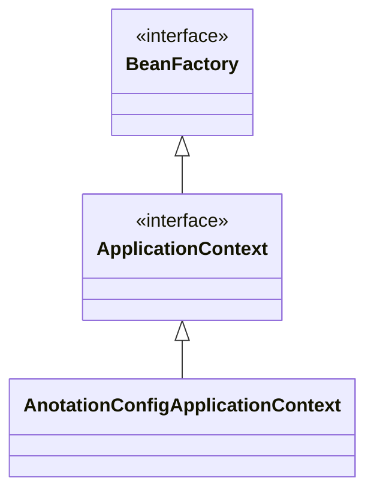
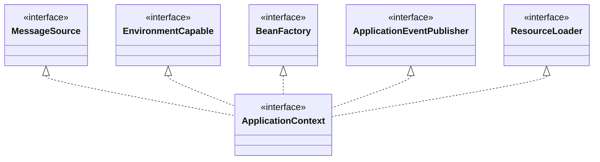
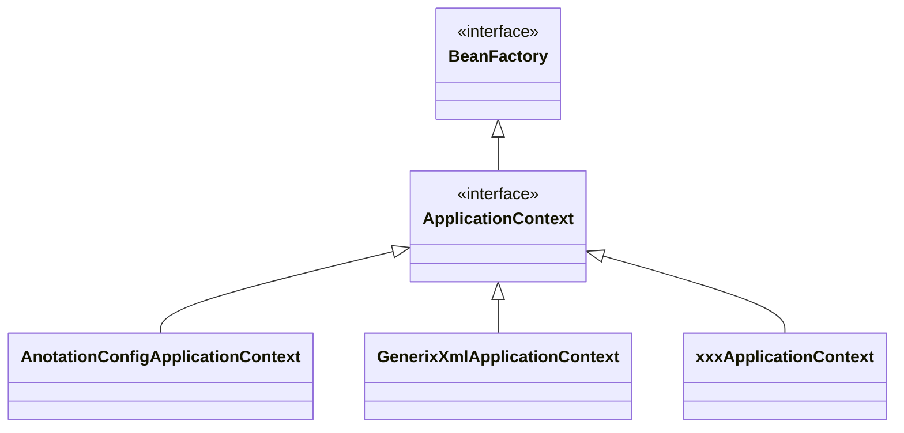

# 스프링 컨테이너

## 스프링 컨테이너란?

- ApplicationContext
  - 인터페이스
  - 스프링 컨테이너
- 다양한 지원 설정 형식으로 생성 가능.
  - XML
  - **어노테이션**
  - Groovy
- AnnotationConfigApplicationContext - 어노테이션 기반 구현체.
- `BeanFactory`, `ApplicationContext`로 구성.

## 스프링 컨테이너 생성 과정

```java
@Configuration
public class AppConfig {
    @Bean
    public MemberService memberService() {  // key
        return new MemberServiceImpl(memberRepository()); // value로 컨테이너에 저징됨.
    }

    @Bean
    public MemberRepository memberRepository() {
        return new MemoryMemberRepository();
    }
    // ...
}
```

```java
ApplicationContext ac = new AnnotationConfigApplicationContext(AppConfig.class);
MemberService memberService = ac.getBean("memberService", MemberService.class);
```

1. 스프링 컨테이너 생성

   - AnnotationConfigApplicationContext를 생성.
   - AppConfig를 설정 정보로 사용.

2. 스프링 빈 등록

   | 빈 이름          | 빈 객체                    |
   | ---------------- | -------------------------- |
   | memberService    | MemberServiceImpl@x01      |
   | memberRepository | MemoryMemberRepository@x02 |
   | orderService     | OrderServiceImpl@x03       |
   | discountPolicy   | RateDiscountPolicy@x04     |

   - 빈 이름

     - @Bean
     - 기본적으로 메서드 이름
     - @Bean(name="빈 이름")으로 설정 가능.
     - 유니크해야 함. - 같으면 덮어씀. 최신 스프링부트는 에러 발생.

   - 빈 객체

     - @Bean 붙은 메서드를 호출해서 받는 객체를 등록.

3. 스프링 빈 의존 관계 설정

   - 설정 정보를 참고하여 의존관게 주입.
   - 자바 코드를 호출 하는 것이 아닌 스프링의 빈을 호출.

## BeanFactory와 ApplicationContext



### BeanFactory

- 스프링 컨테이너의 최상위 인터페이스
- 스프링 빈을 **관리**하고 **조회**.
- getBean()
- 직접 사용할 일은 없음.

### ApplicationContext

- 직접 주로 사용.



- 메시지 소스를 활용한 국제화 기능 - 한국에서는 한국어, 영어권에서는 영어로 출력.
- 환경변수 - 로컬, 개발, 운영 환경 등을 구분해서 처리.
- 애플리케이션 이벤트 - 이벤트를 발행하고 구독하는 모델을 편리하게 지원.
- 편리한 리소스 조회 - 파일, 클래스패스, 외부 등에서 리소스를 편리하게 조회.

## 설정 형식



- 자바 코드, XML, Groovy 등을 지원.

- 어노테이션 기반 자바 코드 설정

  - 자바 코드로 설정.
  - 팩토리 메서드를 활용해서 BeanDefinition 생성

- XML 설정

  - XML 파일로 설정.
  - 스프링 부트에서는 거의 사용하지 않음.
  - XML을 사용하면 컴파일 없이 설정 정보 교체 가능.
  - 빈 정보를 직접 생성.
