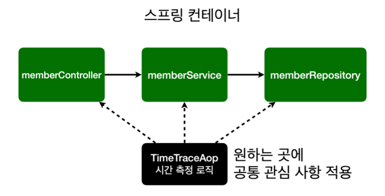
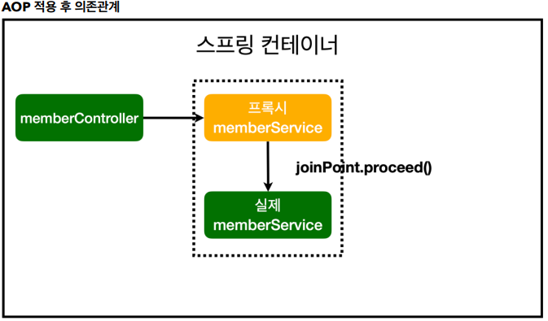

# 07 AOP

## Aspect Oriented Programming

- AOP
- 공통 관심 사항(cross-cutting concern) vs 핵심 관심 사항(core concern) 분리

## AOP가 필요한 상황

- 모든 메소드의 호출 시간을 측정하고 싶다면?
- 공통 관심 사항(cross-cutting concern) vs 핵심 관심 사항(core concern)
- 회원 가입 시간, 회원 조회 시간을 측정하고 싶다면?



## AOP 장점

- 회원가입, 회원 조회등 *핵심 관심사항*과 시간을 측정하는 *공통 관심 사항*을 분리한다.
- 시간을 측정하는 로직을 별도의 공통 로직으로 만들었다.
- 핵심 관심 사항을 깔끔하게 유지할 수 있다.
- 변경이 필요하면 이 로직만 변경하면 된다.
- 원하는 적용 대상을 선택할 수 있다.

## AOP 개념

- Aspect
  - 부가기능 모듈
  - Advice + PointCut
- **JoinPoint**
  - 어드바이스가 적용될 수 있는 위치
  - Spring은 **메소드** 조인포인트만 제공.
- Advice
  - 부가기능을 담은 구현체
  - 애스펙트가 **무엇**을 **언제** 할지를 정의
  - _@Around_, @Before, @After, @AfterReturning, @AfterThrowing
- PointCut
  - 부가기능을 **적용할 대상**을 선정하는 방법
  - pointcut expression
- 타겟(Target)
  - 부가기능을 부여할 대상
- Proxy
  - 타겟을 감싸서 요청을 대신 받아주는 랩핑 오브젝트
- Introduction
  - 타겟 클래스에 코드 변경 없이 신규 메소드나 멤버변수를 추가하는 기능
- Weaving
  - 지정된 객체에 에스팩트를 적용해서 새로운 프록시 객체를 생성하는 과정.

## AOP 구현체

|            | 스프링 AOP  | AspectJ                 |
| ---------- | ----------- | ----------------------- |
| 목표       | 간단한 AOP  | 완벽한 AOP              |
| join point | 메서드      | 생성자, 필드, 메서드 등 |
| weaving    | 런타임      | 컴파일, 전처리, 로드    |
| 대상       | Spring Bean | 모든 java Object        |

- 스프링 AOP는 AspectJ의 어노테이션을 지원함.
- AspectJ가 런타임을 지원하지 않는 것은 IoC컨테이너가 아니므로.

## 코드

```java
@Aspect
// @Component
// 컴포넌트로 등록 할 수도 있지만, 일반적이지 않은 클래스는 빈으로 직접 등록하자.
public class TimeTraceAop {

    @Around("execution(* com.jhyuk316.springtutorial..*(..)) && !target(com.jhyuk316.springtutorial.SpringConfig)")
    public Object execute(ProceedingJoinPoint joinPoint) throws Throwable {
        long start = System.currentTimeMillis();
        System.out.println("START: " + joinPoint.toString());
        try {
            return joinPoint.proceed();
        } finally {
            long finish = System.currentTimeMillis();
            long timeMs = finish - start;
            System.out.println("END: " + joinPoint.toString() + " " + timeMs + "ms");
        }
    }
}
```

### 어노테이션

- @Aspect

  - Aspect 클래스 표기
  - 컴포넌트 스캔의 대상이 아님.
  - @AspectJ의 어노테이션

- @Around("Pointcut Expression")

  - 어드바이스
  - 타겟 메소드 실행 전 후로 수행
  - Pointcut Expression - 적용 대상 타겟팅.

### Pointcut Expression

- 적용 대상 타겟팅.

- execution()

  - 접근제한자, 리턴타입, 인자타입, 클래스/인터페이스, 메소드명, 파라미터타입, 예외타입 등을 전부 조합가능한 가장 세심한 지정자
  - (접근제한자) 리턴타입 (클래스이름).메서드이름(파라미터)

    - 접근제한자 - public, private, 생략가능
    - 리턴 타입
    - 클래스 이름 - 풀 패키지명, 생략 가능
    - 메서드 이름
    - 파라미터
    - \* - 모든 값
    - .. - 0개 이상, 여러개

  - 예시
    - public \* \*(..) - any public method
    - com.xyz.service.AccountService.\*(..) - any method defined by the AccountService interface
    - \* com.xyz.service..\*.\*(..) - any method defined in the service package or one of its _sub-packages_
    - com.xyz.service.AccountService - AccountService 인터페이스

- this()

  - 타입의 빈 레퍼런스인 경우

- target()

  - 타입의 인스턴스인 경우

- @annotation
  - 타겟 메소드에 특정 어노테이션이 지정된 경우
  - @annotation(org.springframework.transaction.annotation.Transactional) - @Transactional이 달린 메소드 전부.

## Bean 등록

```java
@Bean
public TimeTraceAop timeTraceAop() {
    return new TimeTraceAop();
}
```

> 컴포넌트로 등록 할 수도 있지만, 일반적이지 않은 클래스는 빈으로 직접 등록하자.

- 컴포넌트 스캔으로 등록하면 나중에 내가 어떤 AOP를 설정했는지 파악하기 힘듬.
- 어떤 AOP를 걸어 놨는지 나중에 확인이 편함.

## 스프링 AOP의 작동방식

- AOP가 적용되야 하는 빈의 프록시(가짜 빈)를 생성.
- 프록시 안에서 joinPoint.proceed()로 원래 빈을 실행.



---

## 출처

- 스프링 입문 - 코드로 배우는 스프링 부트, 웹 MVC, DB 접근 기술
- AOP 정리 (3) - <https://jojoldu.tistory.com/71?category=635883>
- Spring AOP PointCut 표현식 정리 - <https://icarus8050.tistory.com/8>
- [10분 테코톡] 🌕제이의 Spring AOP - <https://www.youtube.com/watch?v=Hm0w_9ngDpM>
