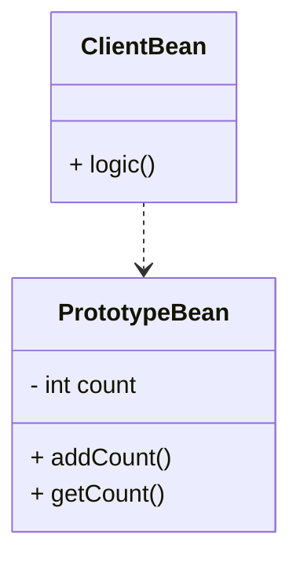
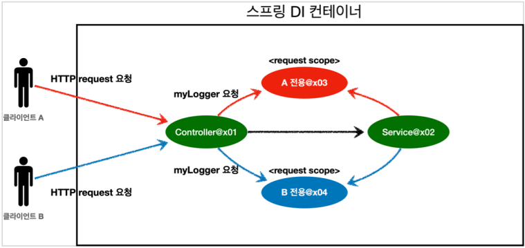
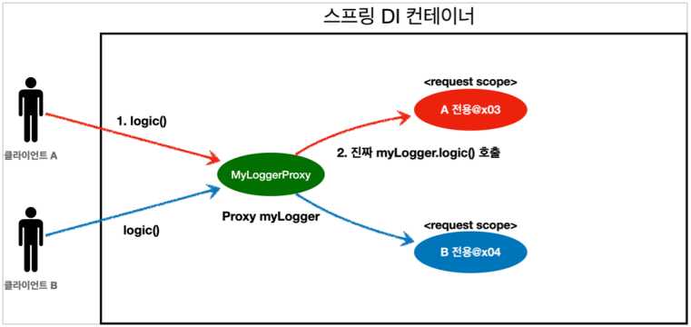

# 빈 스코프

## 빈 스코프

- 빈이 존재할 수 있는 범위
- `@Scope("prototype")`

```java
@Scope("prototype")
@Component
public class HelloBean {}
```

```java
@Scope("prototype")
@Bean
PrototypeBean HelloBean() {
 return new HelloBean();
}
```

- 싱글톤

  - 스프링 컨테이너의 시작과 종료까지 유지.
  - 가장 넓은 범위의 스코프.

- 프로토 타입

  - 스프링 컨테이너는 프로토타입 빈의 생성과 주입까지만 함.
  - 종료 메서드가 호출 되지 않음.
  - 매우 짧은 범위의 스코프.

- 웹 스코프

  - request - 웹 요청이 들어오고 나갈때까지 유지되는 스코프.
  - session - 웹 세션이 생성되고 종료될 때 까지 유지되는 스코프.
  - application - 웹의 서블릿 컨텍스트와 같은 범위로 유지되는 스코프.

## 프로토타입 스코프

- 싱글톤

  - 싱글톤 스코프의 빈을 스프링 컨테이너에 요청하면 항상 **같은 빈**을 반환.
  - 종료 메서드가 호출 됨.

- 프로토타입
  - 프로토타입 스코프의 빈을 스프링 컨테이너에 요청하면 항상 **새로운 빈**을 생성하고 DI해서 반환.
  - 스프링 빈을 관리하지 않음.
  - 종료 메서드가 호출되지 않음.
  - 프로토타입 빈을 관리할 책임은 빈을 받은 클라이언트에 있음.

## 싱글톤 빈과 함께 사용시 문제점



```java
public int logic() {
    this.prototypeBean.addCount();
    return prototypeBean.getCount();
}
```

- 프로토타입 빈을 싱글톤 빈을 의존 하는 경우

  - clientBean는 싱글톤 빈이므로 생성시에 prototypeBean을 생성 후 주입 받음.
  - prototypeBean을 clientBean이 관리하게 됨.
  - clientBean.logic()은 prototypeBean의 addCount() 수행 후 getCount()를 반환.

- 문제점
  - 사용자A가 clientBean.logic()을 실행하고
  - 사용자B가 clientBean.logic()을 실행하면
  - clientBean은 처음에만 prototypeBean을 생성하므로 사용자 A, B가 상태를 공유하게 됨.
  - 프로토타입이지만 매번 생성되지 않음.

## Provider - 싱글톤 빈과 프로토타입 빈 함께 사용하기.

- Dependency Lookup(DL) - 의존관계 탐색(조회). 의존을 주입 받는 것이 아니라 찾아서 쓰기 위함.

### ObjectFactory, ObjectProvider

```java
static class ClientBean {
    private ObjectProvider<PrototypeBean> prototypeBeanProvider;

    public ClientBean(ObjectProvider<PrototypeBean> prototypeBeanProvider) {
        this.prototypeBeanProvider = prototypeBeanProvider;
    }

    public int logic() {
        PrototypeBean prototypeBean = prototypeBeanProvider.getObject();
        prototypeBean.addCount();
        return prototypeBean.getCount();
    }
}
```

- ObjectFactory

  - 기능 단순.
  - 별도의 라이브러리 필요 없음.
  - 스프링에 의존.

- ObjectProvider

  - ObjectFactory 상속.
  - 옵션, 스프림 처리 등을 추가.
  - **별도의 라이브러리 필요 없음.**
  - 스프링에 의존.

- 스프링 빈을 찾아 주는 것.
- 직접 조회하는 것이 아니라 대신 조회해줌.
- ObjectProvider의 getObject()를 호출하면 해당 빈을 찾아서 반환.(DL)
- 단위 테스트를 만들거나, mock 코드를 만들기 쉬움.

### JSR-330 Provider

- javax.inject.Provider

  - 추가 라이브러리 필요.
  - 기능이 매우 단순.
  - **자바 표준.**
  - 표준이므로 다른 컨테이너에서도 사용 가능.

  - Provider의 get()으로 새로운 프로토타입 빈이 생성됨.

> 스프링만 사용 할 때는 ObjectProvider를  
> 다른 프레임워크와 함께 쓸 때는 JSR-330 Provider를 쓰자.

> 스프링과 표준이 제공하는 기능이 겹칠 때가 많다.  
> 대부분 스프링의 기능을 사용.  
> 하지만 스프링이 표준을 추천하는 경우에는 표준사용. eg. JPA, @PostConstruct, @PreDestroy

### Provider를 사용 할 때

- Lazy - 지연 로드
- Optional
- circular dependencies - 순환 참조를 피할 때

## 웹 스코프

- 웹 환경에서만 동작.
- 스프링이 스코프의 종료시점까지 관리. 종료메서드 호출됨.

- 웹 스코프 종류

  - requset
    - HTTP 요청 하나가 들어오고 나갈 때까지 유지되는 스코프
    - HTTP 요청 마다 별도의 빈 인스턴스가 생성되고 관리됨.
  - session
    - HTTP 세션과 동일한 생명주기를 가지는 스코프.
  - application
    - ServletContext와 동일한 생명주기를 가지는 스코프.
  - websocket
    - 웹 소켓과 동일한 생명주기를 가지는 스코프.

- 웹 스코프 동작

  

  - 각 요청 마다 새로운 스코프가 생성됨.

## 웹 스코프 예제

### 웹 환경 추가

- bulid.gradle에 추가
  - `implementation 'org.springframework.boot:spring-boot-starter-web'`
- AnnotationConfig**ServletWebServer**ApplicationContext 사용
  - AnnotationConfigApplicationContext에 웹 관련 추가 설정, 환경 추가.

### request 스코프 예제

```java
@Component
@Scope(value = "request")
public class MyLogger {

    private String uuid;
    private String requestURL;

    public void setRequestURL(String requestURL) {
        this.requestURL = requestURL;
    }

    public void log(String message) {
        System.out.println("[" + uuid + "]" + "[" + requestURL + "] " + message);
    }

    @PostConstruct
    public void init() {
        uuid = UUID.randomUUID().toString();
        System.out.println("[" + uuid + "]" + "request scope bean create:" + this);
    }

    @PreDestroy
    public void close() {
        System.out.println("[" + uuid + "]" + "request scope bean close:" + this);
    }
}
```

- 로그를 출력하기 위한 MyLogger 클래스이다.
- @Scope(value = "request") 를 사용해서 request 스코프로 지정
- @PostConstruct 초기화 메서드
  - uuid를 생성해서 저장
  - 시작 메시지
- @PreDestroy
  - 종료 메시지
- requestURL 은 이 빈이 생성되는 시점에는 알 수 없으므로, 외부에서 setter로 입력 받는다.

#### 컨트롤러

```java
@Controller
@RequiredArgsConstructor
public class LogDemoController {
    private final LogDemoService logDemoService;
    private final MyLogger myLogger;

    @RequestMapping("log-demo")
    @ResponseBody
    public String logDemo(HttpServletRequest request) {
        String requestURL = request.getRequestURL().toString();
        myLogger.setRequestURL(requestURL);

        myLogger.log("controller test");
        logDemoService.logic("testId");
        return "OK";
    }
}
```

- 로거가 잘 작동하는지 확인하는 테스트용 컨트롤러다.
- 여기서 HttpServletRequest를 통해서 요청 URL을 받았다.
- requestURL 값 http://localhost:8080/log-demo
- 이렇게 받은 requestURL 값을 myLogger에 저장해둔다. myLogger는 HTTP 요청 당 각각 구분되므로 다른 HTTP 요청 때문에 값이 섞이는 걱정은 하지 않아도 된다.
- 컨트롤러에서 controller test라는 로그를 남긴다.

> requestURL을 MyLogger에 저장하는 부분은 컨트롤러 보다는 공통 처리가 가능한 스프링 인터셉터나 서블릿 필터 같은 곳을 활용하는 것이 좋다.  
> 여기서는 예제를 단순화하고, 아직 스프링 인터셉터를 학습하지 않은 분들을 위해서 컨트롤러를 사용했다.  
> 스프링 웹에 익숙하다면 인터셉터를 사용해서 구현해보자

#### 서비스

- 코드는 컨트롤러 비슷함.
- 비즈니스 로직이 있는 서비스 계층에서도 로그를 출력해보자.

> 여기서 중요한점이 있다. request scope를 사용하지 않고 파라미터로 이 모든 정보를 서비스 계층에 넘긴다면, 파라미터가 많아서 지저분해진다. 더 문제는 requestURL 같은 웹과 관련된 정보가 웹과 관련없는 서비스 계층까지 넘어가게 된다. 웹과 관련된 부분은 컨트롤러까지만 사용해야 한다. 서비스 계층은 웹 기술에 종속되지 않고, 가급적 순수하게 유지하는 것이 유지보수 관점에서 좋다.

- request scope의 MyLogger 덕분에 이런 부분을 파라미터로 넘기지 않고, MyLogger의 멤버변수에 저장해서 코드와 계층을 깔끔하게 유지할 수 있다.

#### 결과 - 오류 발생

> Error creating bean with name 'myLogger': Scope 'request' is not active for the current thread; consider defining a scoped proxy for this bean if you intend to refer to it from a singleton;

- 리퀘스트가 없는데 빈을 생성하고 주입하려고 해서 스코프 위반 오류.
- 빈은 실제 고객의 요청이 와야 생성할 수 있다!

#### 문제 해결 - Provider

- http://localhost:8080/log-demo
- ObjectProvider 덕분에 ObjectProvider.getObject() 를 호출하는 시점까지 request scope 빈의 생성 요청을 지연할 수 있다.
- ObjectProvider.getObject() 를 호출하시는 시점에는 HTTP 요청이 진행중이므로 request scope 빈의 생성이 정상 처리된다.
- ObjectProvider.getObject() 를 LogDemoController , LogDemoService 에서 각각 한번씩 따로 호출해도 같은 HTTP 요청이면 같은 스프링 빈이 반환된다!
- 내가 직접 이걸 구분하려면 얼마나 힘들까

## 프록시

```java
@Component
@Scope(value = "request", proxyMode = ScopedProxyMode.TARGET_CLASS)
public class MyLogger {
    // ...
}
```

- `proxyMode = ScopedProxyMode.TARGET_CLASS`
  - TARGET_CLASS - 적용 대상이 클래스
  - INTERFACES - 적용 대상이 인터페이스
- 이렇게 하면 MyLogger의 가짜 프록시 클래스를 만들어두고 HTTP request와 상관 없이 가짜 프록시 클래스를 다른 빈에 미리 주입해 둘 수 있다.



- CGLIB라는 라이브러리로 내 클래스를 상속 받은 가짜 프록시 객체를 만들어서 주입한다.

  - @Scope 의 proxyMode = ScopedProxyMode.TARGET_CLASS) 를 설정하면 스프링 컨테이너는 CGLIB 라는 바이트코드를 조작하는 라이브러리를 사용해서, MyLogger를 상속받은 가짜 프록시 객체를 생성한다.
  - 결과를 확인해보면 우리가 등록한 순수한 MyLogger 클래스가 아니라 MyLogger$$EnhancerBySpringCGLIB 이라는 클래스로 만들어진 객체가 대신 등록된 것을 확인할 수 있다.
  - 그리고 스프링 컨테이너에 "myLogger"라는 이름으로 진짜 대신에 이 가짜 프록시 객체를 등록한다.
  - ac.getBean("myLogger", MyLogger.class) 로 조회해도 프록시 객체가 조회되는 것을 확인할 수 있다.
  - 그래서 의존관계 주입도 이 가짜 프록시 객체가 주입된다.

- 가짜 프록시 객체는 요청이 오면 그때 내부에서 진짜 빈을 요청하는 위임 로직이 들어있다.

  - 가짜 프록시 객체는 내부에 진짜 myLogger를 찾는 방법을 알고 있다.
  - 클라이언트가 myLogger.logic() 을 호출하면 사실은 가짜 프록시 객체의 메서드를 호출한 것이다.
  - 가짜 프록시 객체는 request 스코프의 진짜 myLogger.logic() 를 호출한다.
  - 가짜 프록시 객체는 원본 클래스를 상속 받아서 만들어졌기 때문에 이 객체를 사용하는 클라이언트 입장에서는 사실 원본인지 아닌지도 모르게, 동일하게 사용할 수 있다(다형성)

- 동작 정리

  - CGLIB라는 라이브러리로 내 클래스를 상속 받은 가짜 프록시 객체를 만들어서 주입한다.
  - 이 가짜 프록시 객체는 실제 요청이 오면 그때 내부에서 실제 빈을 요청하는 위임 로직이 들어있다.
  - 가짜 프록시 객체는 실제 request scope와는 관계가 없다. 그냥 가짜이고, 내부에 단순한 위임 로직만 있고, 싱글톤 처럼 동작한다

- 특징 정리

  - 프록시 객체 덕분에 클라이언트는 마치 싱글톤 빈을 사용하듯이 편리하게 request scope를 사용할 수 있다.
  - 사실 Provider를 사용하든, 프록시를 사용하든 핵심 아이디어는 **진짜 객체 조회를 꼭 필요한 시점까지 지연처리** 한다는 점이다.
  - 단지 애노테이션 설정 변경만으로 원본 객체를 프록시 객체로 대체할 수 있다. 이것이 바로 **다형성과 DI 컨테이너가 가진 큰 강점**이다.
  - 꼭 웹 스코프가 아니어도 프록시는 사용할 수 있다.

- 주의점

  - 마치 싱글톤을 사용하는 것 같지만 다르게 동작하기 때문에 결국 주의해서 사용해야 한다.
  - 이런 특별한 scope는 꼭 필요한 곳에만 *최소화해서 사용*하자, 무분별하게 사용하면 유지보수하기 어려워진다.
