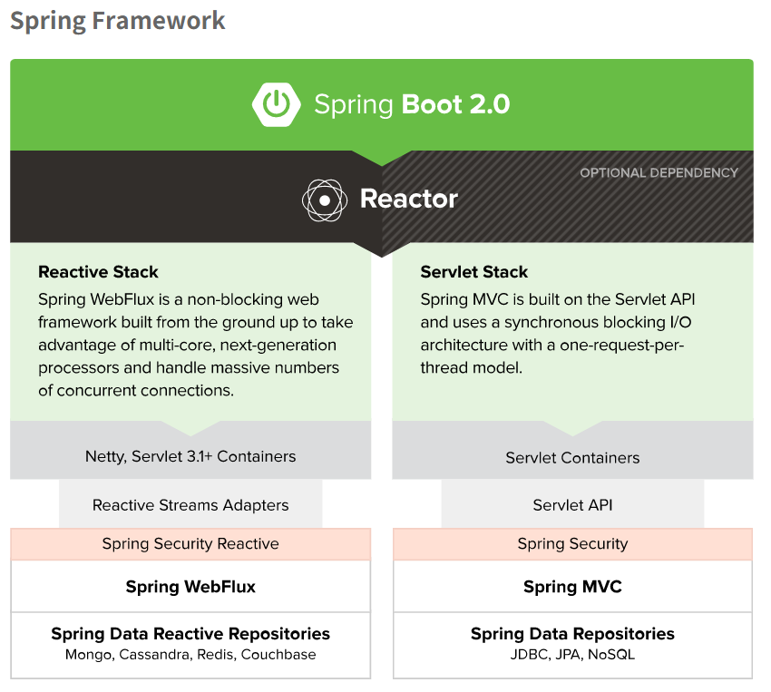

# WebFlux

## Servlet의 변화

- Servlet 3.0 - Async Servlet(비동기 서블릿)
  - 사용자의 요청을 받는 스레드(servlet thread)와 작업을 수행하는 스레드(worker thread)를 분리
- Servlet 3.1 - Non-Blocking I/O

  - request 및 response를 처리하는 I/O를 Non-Blocking으로 수행

- Blocking I/O를 통한 한계

  - Servlet의 API / Data Access / 추가 라이브러리 등 에서 결국 Blocking I/O가 수행

- 100% 완전한 비동기 / Non-Blocking 을 위한 새로운 Stack 개발의 필요성
- WebFlux라는 이름을 가진 Spring의 Reactive-Stack의 등장

## SpringMVC vs WebFlux

- 특징

  - Request를 Event-Driven 방식으로 처리 (기본 WAS가 Netty)
    - 사용자의 요청 / application 작업 모두 Event로 관리
    - Event Queue에 Event가 쌓인다
    - Event Loop를 통해 순차적으로 처리
  - 요청을 받는 Thread가 Blocking되지 않는다
    - Context Switching이 적다
  - 결과적으로, 완전한 논블록킹으로 구성된다면,
  - 적은 Thread를 통해 많은 처리를 할 수있는 효율적인 모델을 구축할 수 있다

- 주의
  - 오히려 Blocking I/O가 발생하면 SpringMVC에 비해 성능이 떨어질 수 있음
    - 상대적으로 적은 Thread Pool이기 때문
  - 논블록킹 Data Access를 사용해야 한다
    - JDBC 기반의 기술들(JPA 등)은 결국 모두 Blocking하게 동작
  - WebClient를 통한 논블록킹 api call이 필요하다
    - 기존의 RestTemplate은 기본적으로 Blocking하게 동작

---

## 출처

- WebFlux (2) - WebFlux 란 ? / SpringMVC vs WebFlux - <https://velog.io/@neity16/WebFlux-2-WebFlux-%EB%9E%80-SpringMVC-vs-WebFlux>
