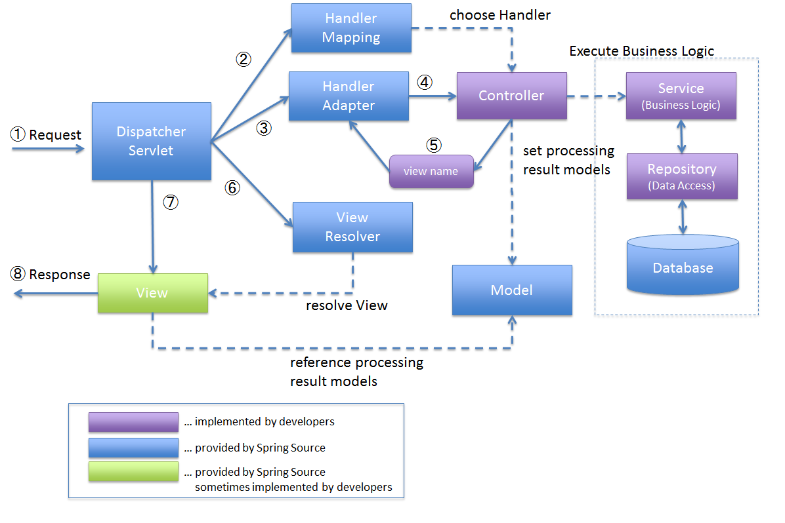

# DispatcherServlet

## WebServer vs WAS

- Web Server

  - Static Server
  - Static Pages 반환
  - 정적인 컨덴츠 제공(html, jpg emd)

- WAS - Web Application Server

  - Dynamic Pages 반환
  - 동적인 컨덴츠 제공(jsp, 서블릿 등)

- Web Service Architecture

  

  - 보통 Web Server를 WAS 앞에 붙여 놓는 구조를 가짐.
  - Web Server가 필요한 이유
    - WAS의 부하 감소 - 서버를 분리해 정적 컨덴츠를 따로 처리 할 수 있음.
    - 여러 대의 WAS에 적절한 부하를 분산 시키는 역할.

## Servlet

- 자바를 사용하여 웹페이지를 동적으로 생성하는 서버측 프로그램 혹은 그 사양.

- 특징

  - 클라이언트의 Request에 대해 동적으로 작동하는 웹 애플리케이션 컴포넌트.
  - HTML을 사용하여 Response.
  - JAVA의 스레드를 이용하여 동작.
  - MVC 패턴에서의 컨트롤러로 이용.
  - javax.servlet.http.HttpServlet
  - HTML 변경 시 Servlet을 재 컴파일해야 하는 단점이 있음.

- 서블릿과 JSP

  - 서블릿 - 자바 코드 안에 HTML을 포함
  - JSP - HTML 문서 안에 Java 코드를 포함

- 웹 통신 과정

  1. 소켓 연결
  2. HTTP 요청 파싱
  3. **요청에 맞는 비즈니스 로직 실행**
  4. HTTP 응답 생성
  5. 소켓 종료

  - 서블릿은 반복 되는 1,2,4,5의 작업을 편하게 도와줌.
  - 개발자는 비즈니스 로직에만 집중 할 수 있음.

### HttpServletRequest, HttpServletResponse

- HTTP 요청/응답 정보를 자바 객체화해서 제공

- HttpServletRequest

  - HTTP 요청 정보를 제공
  - HTTP 요청 메세지를 편리하게 사용할 수 있도록 해주는 객체
  - 헤더 정보, 파라미터, 쿠키, URI, URL, Body
  - 임시 저장소 기능
    - 해당 HTTP 요청이 시작부터 끝날 때까지 유지되는 임시 저장소 기능
    - 저장 - `reuqest.setAttribute(name, value)`
    - 조회 - `request.getAttribute(name)`
  - 세션 관리 기능
    - `request.getSession(create:true)`

- HttpServletResponse
  - HTTP 응답 정보를 제공
  - content-type, 응답 코드, 응답 메세지
  - Response 객체 생성
    1. HTTP 응답 코드 지정
    2. 헤더 생성
    3. 바디 생성

### 서블릿 컨테이너

- 서블릿을 담고 관리해주는 컨테이너
- 웹 컨테이너

- 주요 기능

  - 서블릿의 생명주기 관리
    - 생성, 초기화, 호출, 종료
    - 서블릿 객체는 싱글톤으로 관리.
  - 통신 지원
    - 클라이언트의 Request를 받아주고 Response를 보낼 수 있게 웹 서버와 소켓을 만들어서 통신
  - 멀티스레딩 관리
  - 선언적인 보안관리

- 요청에 따라 설정파일에 설정된 서블릿을 맵핑.
- 서블릿 마다 공통 로직 중복.

## DispatcherServlet

- 모든 요청을 받는 프론트 컨트롤러
  - 공통 로직을 처리.

1. DispatcherServlet이 요청을 받음.
2. DispatcherServlet가 HandlerMapping에게 요청.
   1. HandlerMapping가 컨트롤러 반환.
3. DispatcherServlet는 HandlerAdapter에게 Controller 실행 작업을 보냄.
4. HandlerAdapter는 Controller의 비즈니스 로직을 호출.
5. Controller는 비즈니스 로직을 실행하고 결과를 Model에 반영, View를 HandlerAdapter로 반환.
6. DispatcherServlet는 ViewResolver에게 View 이름과 작업을 보냄.
   1. ViewResolver는 View 이름과 맵핑된 View를 리턴
7. DispatcherServlet는 View에게 랜더링 작업을 보냄.
8. View는 Model data를 랜더링.
   1. response를 반환

### HandlerMapping, HandlerAdapter

- HandlerMapping

  - RequestMappingHandlerMapping - 어노테이션으로 찾음.
  - BeanNameUrlHandlerMapping - 스프링 빈 이름으로 핸들러 찾음.

- HandlerAdapter

  - RequestmappingHandlerAdapter - 어노테이션 찾음
  - HttpRequestHandlerAdapter
  - SimpleControllerHandlerAdapter - Controller 인터페이스 처리, _어노테이션이 아님_

- 순서
  - 핸들러 매핑으로 핸들러 조회
  - 핸들러가 실행가능한 어뎁터를 찾음.
  - 핸들러 어뎁터 실행.

### ViewResolver

- BeanNameViewResolver - 빈 이름으로 찾아서 뷰 반환.
- InternalResourceViewResolver - jsp를 처리하는 뷰 반환.

- 순서
  - 핸들러 어댑터 호출 - 반환된 이름의 뷰 획득(컨트롤러 리턴)
  - ViewResolver 순서대로 호출,(찾기?)
    - BeanNameViewResolver가 못 찾으면
    - InternalResourceViewResolver 호출.
  - ViewResolver 반환
  - view.render();

---

## 출처

- <https://docs.spring.io/spring-framework/docs/current/reference/html/web.html#mvc-servlet-context-hierarchy>
- Overview of Spring MVC Architecture - <http://terasolunaorg.github.io/guideline/5.4.1.RELEASE/en/Overview/SpringMVCOverview.html>

- [Web] Web Server와 WAS의 차이와 웹 서비스 구조 - <https://gmlwjd9405.github.io/2018/10/27/webserver-vs-was.html>

- [Web] 서블릿(Servlet)이란 무엇인가? 서블릿 총정리 - <https://coding-factory.tistory.com/742>
- [JSP] 서블릿(Servlet)이란? - <https://mangkyu.tistory.com/14>
- [Servlet] 서블릿(Servlet)이란? - <https://velog.io/@falling_star3/Tomcat-서블릿Servlet이란>
- DispatcherServlet - Part 1 - <https://tecoble.techcourse.co.kr/post/2021-06-25-dispatcherservlet-part-1/>
- Spring MVC framework

### 김영한 MVC 수강생들 ㅋㅋㅋ

- <https://www.inflearn.com/course/스프링-mvc-1>
- 웹 애플리케이션 이해 - <https://catsbi.oopy.io/defe6c4d-1d74-4a5e-8349-ff9077dda184>
- [6] 스프링 MVC (6) - 스프링 MVC 구조 (DispatcherServlet / HandlerMapping / HandlerAdapter / viewResolver)
- <https://velog.io/@neity16/6-스프링-MVC-6-스프링-MVC-구조-DispatcherServlet-HandlerMapping-HandlerAdapter-viewResolver>
- 스프링 MVC - 구조 이해 - <https://velog.io/@gustjtmd/스프링-MVC-구조-이해>
- [Spring] Spring MVC & DispatcherServlet - <https://velog.io/@hyunjong96/Sprin-Spring-MVC-DispatcherServlet>
- [스프링 MVC 1편 - 백엔드 웹 개발 핵심 기술] 1. 웹 애플리케이션 이해 - <https://velog.io/@gangjjang5/스프링-MVC-1편-백엔드-웹-개발-핵심-기술-1.-웹-애플리케이션-이해>
