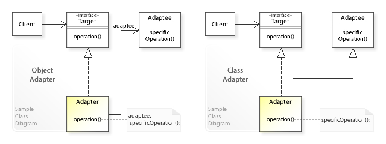

# Design Patterns

## 어댑터 패턴(Adapter Pattern)

- 클래스의 인터페이스를 사용자가 기대하는 다른 인터페이스로 변환하는 패턴
- 호환성이 없는 인터페이스 때문에 함께 동작할 수 없는 클래스들이 함께 작동하도록 해줌.

- 매번 요구사항마다 새로운 알고리즘을 만들거나 타입별로 비슷한 알고리즘들을 새로 구현할 필요 없이 기존의 알고리즘을 변형해 재활용



- 과정

  - 클라이언트는 Target Interface를 통해 어댑터에 요청
  - adapter는 클라이언트의 요청을 Adaptee가 이해할 수 있는 방법으로 전달
  - Adaptee는 처리

- Target Interface

  - Client가 사용할 원하는 인터페이스
  - Adapter가 implements하는 인터페이스

```java
public interface BtoCAdapter {
    public Usb getCType();
}
```

- adaptee
  - 기존 코드, 외부 라이브러리

```java
public class Usb {
    private String type;

    public Usb(String type) {
        this.type = type;
    }

    public String getType() {
        return type;
    }

    public void setType(String type) {
        this.type = type;
    }
}

public class UsbTypeB {
    public Usb getBType() {
        return new Usb("B");
    }
}
```

- adapter

  - Client와 Adaptee 중간에서 호환성이 없는 둘을 연결시켜주는 역할
  - Target Interface를 implements

### Object Adapter

- 합성, 위임

```java
public class BtoCObjectAdapterImpl implements BtoCAdapter {

    private UsbTypeB usbTypeB;

    public BtoCObjectAdapterImpl(UsbTypeB usbTypeB) {
        this.usbTypeB = usbTypeB;
    }

    @Override
    public Usb getCType() {
        return convertType(usbTypeB.getBType(), "C");
    }

    private Usb convertType(Usb usb, String type){
        usb.setType(type);
        return usb;
    }
}
```

### Class Adapter

- 상속

```java
public class BtoCClassAdapterImpl extends UsbTypeB implements BtoCAdapter{
    @Override
    public Usb getCType() {
        return convertType(getBType(), "C");
    }

    private Usb convertType(Usb usb, String type){
        usb.setType(type);
        return usb;
    }
}
```

### Client

```java
public class Client {
    public static void main(String[] args) {
        //Class Adapter
        BtoCAdapter classAdapter = new BtoCClassAdapterImpl();
        System.out.println("Current USB Type : "+classAdapter.getCType().getType());

        //Object Adapter
        UsbTypeB usbTypeB = new UsbTypeB();
        BtoCAdapter objectAdapter = new BtoCObjectAdapterImpl(usbTypeB);
        System.out.println("Current USB Type : "+objectAdapter.getCType().getType());
    }
}
```

---

## 출처

- Adapter pattern - <https://en.wikipedia.org/wiki/Adapter_pattern>
- [Java] 디자인 패턴 - 어댑터 패턴(Adapter Pattern) - <https://m.blog.naver.com/dktmrorl/222084011455>
- [Design Pattern] GoF 구조 패턴 - 어댑터 패턴(Adapter Pattern) - <https://4z7l.github.io/2021/01/29/design_pattern_adapter.html>
