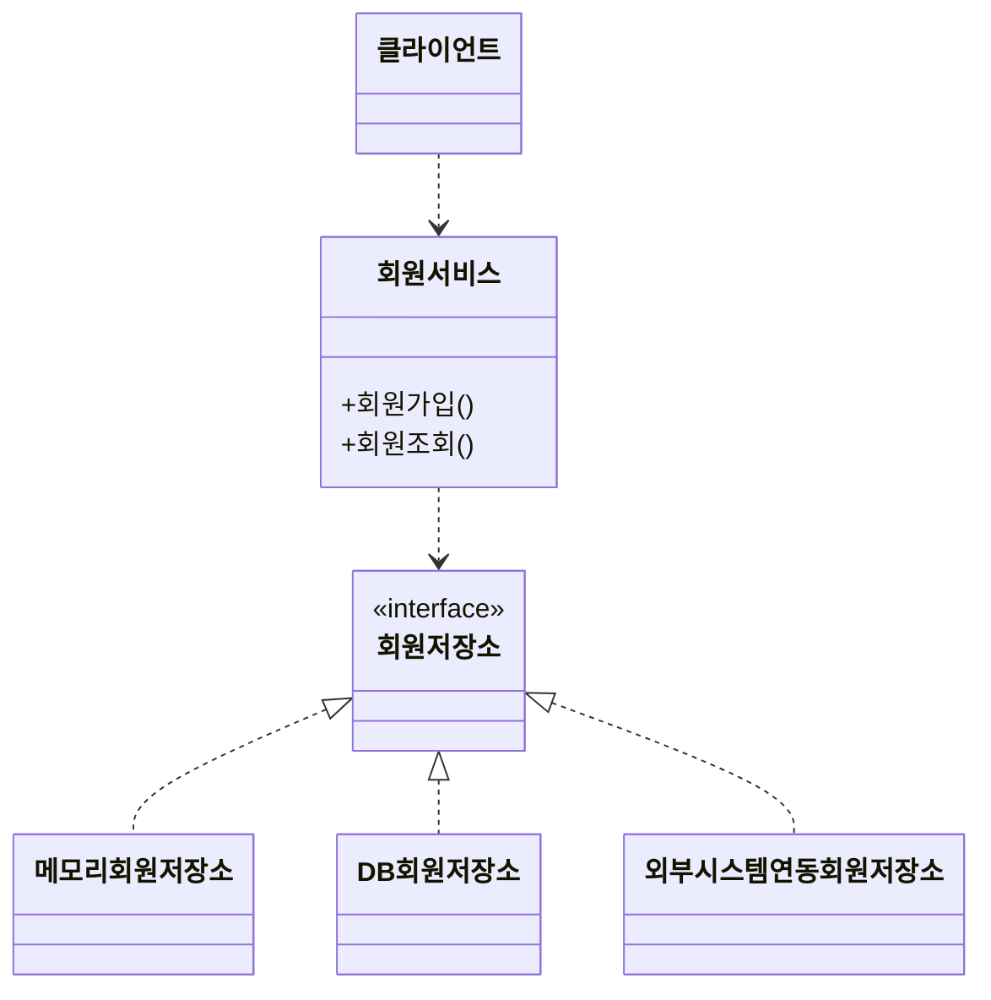
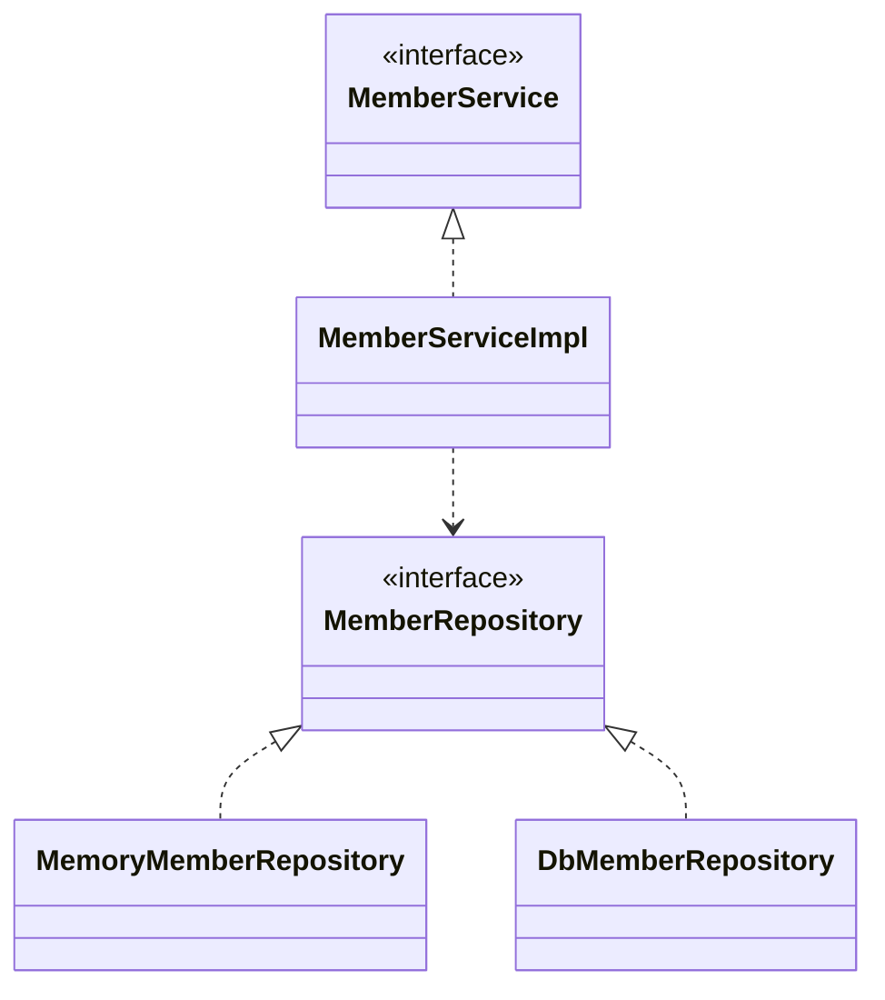

# 예제

## 비즈니스 요구사항과 설계

- 회원

  - 회원 가입, 조회
  - 회원등급 - 일반, VIP
  - 회원 데이터 (미확정)
    - 자체 DB를 구축
    - 외부 시스템과 연동

- 주문과 할인 정책

  - 회원은 상품을 주문
  - 회원 등급에 따라 할인 정책을 적용
  - 할인 정책
    - 모든 VIP는 1000원을 할인, 고정 금액 할인을 적용.
    - 나중에 변경 될 수 있음.
  - 할인 정책은 변경 가능성이 높음.
    - 회사의 기본 할인 정책을 아직 정하지 못했고, 오픈 직전까지 고민을 미루고 싶다. 최악의 경우 할인을 적용하지 않을 수 도 있다. (미확정)

> 요구사항을 보면 회원 데이터, 할인 정책 같은 부분은 지금 결정하기 어려운 부분이다. 그렇다고 이런 정책이 결정될 때 까지 개발을 무기한 기다릴 수 도 없다. **우리는 앞에서 배운 객체 지향 설계 방법이 있지 않은가!**

- 도메인 다이어그램 - 기획자

- 클래스 다이어그램 - 개발자

- 객체 다이어그램 - 실제 사용하는 인스턴스 흐름.
