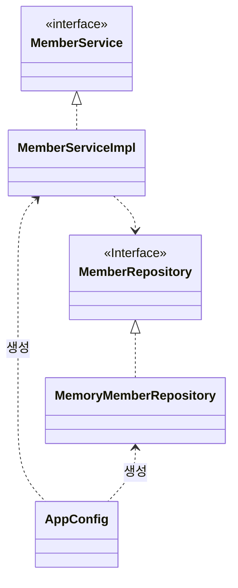

# 객체 지향 적용

## 관심사 분리

- 관심사 분리 관점의 스프링
- 구현 클래스는 역할에만 집중.
- 구현 클래스가 변경되어도 똑같이 동작.
- 역할과 구현을 연결하는 설계자, 연결자.

## AppConfig

- 객체의 생성과 연결을 담당
- 구성 영역

- 생성자 의존성 주입
- `return new MemberServiceImpl(new MemoryMemberRepository());`

- 애플리케이션 동작에 필요한 구현 객체를 생성.
- 생성한 객체 인스턴스의 참조를 생성자를 통해 주입.

- 결과
  - 설계 변경으로 MemberServiceImpl 은 MemoryMemberRepository 를 의존하지 않는다!
  - 단지 MemberRepository 인터페이스만 의존.
  - MemberServiceImpl 입장에서 생성자를 통해 어떤 구현 객체가 주입될지는 알 수 없다.
  - MemberServiceImpl의 생성자를 통해서 어떤 구현 객체를 주입할지는 오직 외부( AppConfig )에서 결정된다.
  - MemberServiceImpl 은 이제부터 의존관계에 대한 고민은 외부에 맡기고 실행에만 집중하면 된다.

> DIP 완성

> 클라이언트 입장에선 의존관계를 마치 외부에서 주입해주는 것 같다.

## OrderServiceImpl

- DiscountPoilcy 인터페이스에만 의존.
- 어떤 구현체가 들어 올지 알 수 없음.
- 오직 AppConfig가 결정.

## 할인 정책 변경

- AppConfig에서 `FixDiscountPolicy를 RateDiscountPolicy`객체로 변경
- 사용 영역의 **어떤 코드**도 변경할 필요가 없음.
- 구성 영역

## 객제 지향 설계의 5가지 원칙 적용

- DI를 적용해서 변경된 점.

### SRP

- Before - 클라이언트 객체는 구현 객체를 생성, 연결, 실행
- 관심사 분리
- 구현 객체를 실행만 하게 하자.

### DIP

- Before - 클라이언트는 인터페이스와 구현 클래스에 함께 의존 하였음.
- 의존을 외부에서 주입하면 DIP를 지킬 수 있음.
- 클라이언트가 인터페이스에만 의존.

### OCP

- 애플리케이션을 사용 영역과 구성 영역으로 나눔
- 구성 영역에서 변경하면 클라이언트 코드는 변경할 필요가 없음.
- **소프트웨어 요소를 새롭게 확장해도 사용 영역의 변경은 닫혀있음.**

## IoC, DI, 컨테이너

### IoC 제어 역전

- 일반적 제어
  - 프로그래머가 구현 객체 생성, 연결, 실행 하는 것.
  - 구현 객체가 프로그램의 제어 흐름을 결정.
  - 프로그래머에게 익숙하고 자연스러움.
- 제어 역전(IoC)
  - 프레임워크가 구현 객체를 생성, 연결, 실행.
  - 구현 객체는 로직을 실행하는 역할만 함.
  - AppConfig가 프로그램의 제어 흐름을 결정.
  - 외부에서 관리하고 관리하는 것.

> 라이브러리 - 내가 작성한 코드가 직접 제어의 흐름을 담당함.
> 프레임워크 - 프레임워크가 코드를 제어하고 실행함. (JUnit, Spring)

### DI 의존성 주입

- 클라이언트는 인터페이스에 의존. 어떤 구현 객체를 사용할지 모름.

- 정적인 클래스 의존 관계

  - 클래스가 사용하는 import로 쉽게 판단.
  - 애플리케이션을 실행하지 않아도 분석 가능.

- 동적인 객체 의존 관계
  - 어떤 구현 객체가 들어올지 코드만으로는 알 수 없음.
  - 런타임에 구현 객체를 생성하고 클라이언트에 **의존성 주입**.
  - 객체가 참조로 연결됨.
  - 정적인 클래스 의존관계를 변경하지 않고, 동적인 객체 의존만 변경 가능.

### IoC 컨테이너, DI 컨테이너

- 객체를 생성하고 관리하고 의존관계를 연결 해주는 것.
- 어셈블러, 오브젝트 펙토리 등으로도 불림.

## 스프링 적용

### 스프링 컨테이너

- `ApplicationContext` - 스프링 컨테이너
- 스프링 컨테이너를 통해 의존성 주입
- @Configuration가 붙은 클래스를 구성 정보로 사용.
- 구성 정보 안의 @Bean이 붙은 메서드를 모두 스프링 컨테이너에 등록.
- 스프링 컨테이너에 등록된 객체를 스프링 빈이라 함.
- 메서드 명을 스프링 빈의 이름(key)으로 사용.
- 개발자는 스프링 컨테이너에 객체를 스프링 빈으로 등록하고, 스프링 컨테이너에서 찾아야 함.

### @Bean

- 빈 등록
