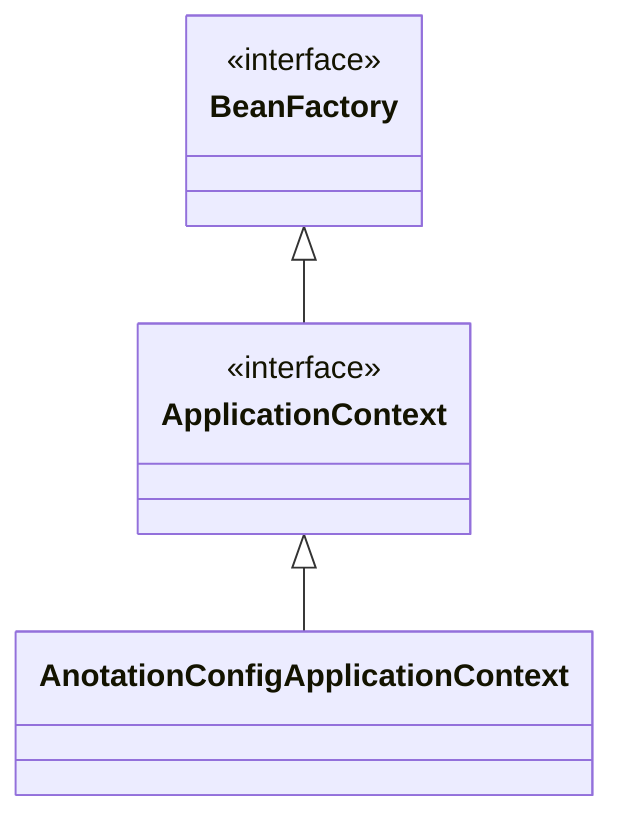
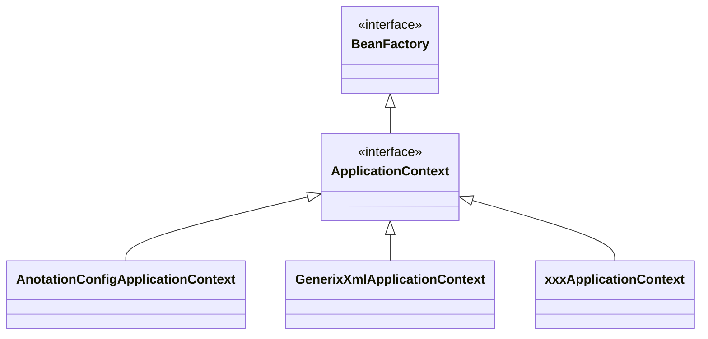

# 스프링

## 스프링 컨테이너 생성

```java
ApplicationContext applicationContext =
        new AnnotationConfigApplicationContext(AppConfig.class);
```

- ApplicationContext
  - 스프링 컨테이너
  - 인터페이스
- 스프링 컨테이너

  - XML 기반, **어노테이션 기반** 으로 가능.
  - AnnotationConfigApplicationContext - 어노테이션 기반 구현체.
  - `BeanFactory`, `ApplicationContext`로 구성.

| 빈 이름          | 빈 객체                    |
| ---------------- | -------------------------- |
| memberService    | MemberServiceImpl@x01      |
| memberRepository | MemoryMemberRepository@x02 |
| orderService     | OrderServiceImpl@x03       |
| discountPolicy   | RateDiscountPolicy@x04     |

- 빈 이름

  - @Bean
  - 기본적으로 메서드 이름
  - @Bean(name="빈 이름")으로 설정 가능.
  - 유니크해야 함. - 같으면 덮어씀. 최신 스프링부트는 에러 발생.

- 빈 객체

  - @Bean 붙은 메서드를 호출해서 받는 객체를 등록.

- 스프링 빈 의존 관계 설정
- 자바 코드를 호출 하는 것이 아닌 스프링의 빈을 호출.

## 스프링 컨테이너 조회

- 등록된 스프링 빈 조회.

```java
void findApplicationBean() {
    String[] beanDefinitionNames = ac.getBeanDefinitionNames();
    for (String beanDefinitionName : beanDefinitionNames) {
        BeanDefinition beanDefinition =
                ac.getBeanDefinition(beanDefinitionName); // 스프링의 모든 빈

        //Role ROLE_APPLICATION: 직접 등록한 애플리케이션 빈
        //Role ROLE_INFRASTRUCTURE: 스프링이 내부에서 사용하는 빈
        if (beanDefinition.getRole() == BeanDefinition.ROLE_APPLICATION) {
            Object bean = ac.getBean(beanDefinitionName);   // 빈 객체 조회.
            System.out.println("name=" + beanDefinitionName + " object=" + bean);
        }
    }
}
```

- BeanDefinition.ROLE_APPLICATION - 애플리케이션 빈 - 내가 만든 빈.
- BeanDefinition.ROLE_INFRASTRUCTURE - 스프링 내부 빈.

- 기본 빈 조회

  - `ac.getBean(빈이름, 타입)`
  - `ac.getBean(타입)`

- 동일한 타입이 둘 이상일 때

  - 빈 이름을 지정해서 검색해야 함.
  - `Map<String, MemberRepository> beans = ac.getBeansOfType(MemberRepository.class);`

- 상속 관계 조회
  - 부모 타입으로 조회하면 자식 타입도 함께 조회.
  - 그래서 *Object*로 조회하면 모든 빈이 나옴.

## 스프링 컨테이너



- BeanFactory

  - 스프링 컨테이너의 최상위 인터페이스
  - 스프링 빈을 관리하고 조회.
  - getBean()
  - 직접 사용할 일은 없음.

- ApplicationContext

  - 직접 주로 사용.

  ```mermaid
  classDiagram
      class BeanFactory
      <<interface>> BeanFactory
      class MessageSource
      <<interface>> MessageSource
      class EnvironmentCapable
      <<interface>> EnvironmentCapable
      class ApplicationEventPublisher
      <<interface>> ApplicationEventPublisher
      class ResourceLoader
      <<interface>> ResourceLoader
      class ApplicationContext
      <<interface>> ApplicationContext
      MessageSource <|.. ApplicationContext
      EnvironmentCapable <|.. ApplicationContext
      BeanFactory <|.. ApplicationContext
      ApplicationEventPublisher <|.. ApplicationContext
      ResourceLoader <|.. ApplicationContext
  ```

  - 메시지 소스를 활용한 국제화 기능 - 한국에서는 한국어, 영어권에서는 영어로 출력.
  - 환경변수 - 로컬, 개발, 운영 환경 등을 구분해서 처리.
  - 애플리케이션 이벤트 - 이벤트를 발행하고 구독하는 모델을 편리하게 지원.
  - 편리한 리소스 조회 - 파일, 클래스패스, 외부 등에서 리소스를 편리하게 조회.

## 설정 형식



- 자바 코드, XML, Groovy 등을 지원.

- 어노테이션 기반 자바 코드 설정

  - 자바 코드로 설정.
  - 팩토리 메서드를 활용해서 BeanDefinition 생성

- XML 설정

  - XML 파일로 설정.
  - 스프링 부트에서는 거의 사용하지 않음.
  - XML을 사용하면 컴파일 없이 설정 정보 교체 가능.
  - 빈 정보를 직접 생성.

## 스프링 빈 설정 메타 정보

> BeanDefinition으로 추상화하여 사용한다는 정도만 이해하자.  
> 직접 사용 할 일은 없음.

- BeanDefinition

  - 빈 설정 메타 정보
  - java코드나 xml 등으로 BeanDefinition을 생성.
  - 스프링 컨테이너는 BeanDefinition을 사용.

- AnnotationConfigApplicationContext 는 AnnotatedBeanDefinitionReader 를 사용해서 AppConfig.class 를 읽고 BeanDefinition 을 생성

### BeanDefinition 정보

- BeanClassName: 생성할 빈의 클래스 명(자바 설정 처럼 팩토리 역할의 빈을 사용하면 없음)
- factoryBeanName: 팩토리 역할의 빈을 사용할 경우 이름, 예) appConfig
- factoryMethodName: 빈을 생성할 팩토리 메서드 지정, 예) memberService
- Scope: 싱글톤(기본값)
- lazyInit: 스프링 컨테이너를 생성할 때 빈을 생성하는 것이 아니라, 실제 빈을 사용할 때 까지 최대한
- 생성을 지연처리 하는지 여부
- InitMethodName: 빈을 생성하고, 의존관계를 적용한 뒤에 호출되는 초기화 메서드 명
- DestroyMethodName: 빈의 생명주기가 끝나서 제거하기 직전에 호출되는 메서드 명
- Constructor arguments, Properties: 의존관계 주입에서 사용한다. (자바 설정 처럼 팩토리 역할의 빈을 사용하면 없음)
