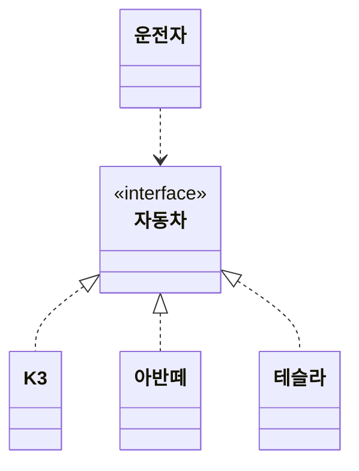
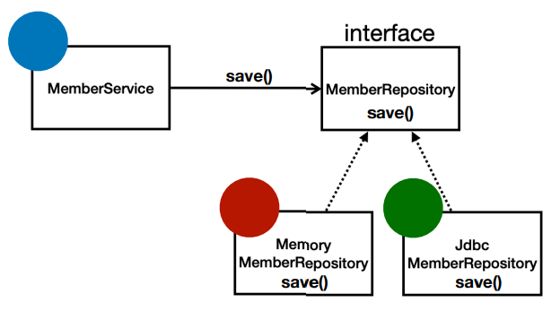

# 객체 지향 프로그래밍

- [1. 구조적 프로그래밍, 절차적](#1-구조적-프로그래밍-절차적)
- [2. Object-Oriented Programming](#2-object-oriented-programming)
  - [2.1. 객체 지향의 특징](#21-객체-지향의-특징)
- [3. 좋은 객체 지향 프로그래밍](#3-좋은-객체-지향-프로그래밍)
  - [3.1. 역할과 구현](#31-역할과-구현)
  - [3.2. 현실에 비유](#32-현실에-비유)
  - [3.3. 다형성](#33-다형성)
- [4. SOLID](#4-solid)
- [5. 출처](#5-출처)

## 1. 구조적 프로그래밍, 절차적

- GOTO문 없는 프로그래밍.

- 저수준 요소
  - 순차적
  - 선택적 - if
  - 반복 - while, for
- 고수준 요소

  - 함수
  - 구조체

- 절차적으로 수행되는 코드 뭉치.
- 유지보수가 어려움.
- 코드 순서가 바뀌면 동일한 결과를 보장하지 못 함.

## 2. Object-Oriented Programming

- 객체들의 모임
- 객체들은 메시지 주고받음.
- 객체들 데이터 처리
- 객체 변경 용이

### 2.1. 객체 지향의 특징

- 추상화
  - 불필요한 정보는 숨기고 중요한 정보만을 표현함
- 캡슐화
  - 객체의 속성(data fields)과 행위(메서드, methods)를 하나로 묶음.
  - 실제 구현 내용 일부를 내부에 감추어 은닉
  - 접근 제한자
    - public : 모든 접근을 허용한다.
    - protected : 자기 클래스 내부 또는 상속받은 자식 클래스에서 접근 허용
    - (dafault) : 동일한 패키지에서만 접근 가능. (java만)
    - private : 자기 클래스 내부의 메서드에서만 접근 허용
- 상속
  - 상속은 새로운 클래스가 기존의 클래스의 자료와 연산을 이용할 수 있게 하는 기능.
  - 부모 클래스 - 새로운 클래스를 생성하는 기반 클래스.
  - 자식 클래스 - 상속을 받아 만들어지는 새로운 클래스.
- **다형성** - 객체 지향의 핵심
  - 계층 구조를 가진 클래스의 코드를 실행하면 자손에 따라 다른 동작을 하는 것.
    > 오버 라이딩 - 같은 이름의 메소드가 여러 클래스에서 다른 기능을 하는 것.  
    > 오버 로딩 - 같은 메소드의 파라미터가 다른 것.
  - 다른 기능(구현)을 가진 클래스들을 같은 인터페이스로 사용.
  - **관심사 분리**를 가능하게 함.

## 3. 좋은 객체 지향 프로그래밍

> 성능보다 **유지보수**가 중요함.

### 3.1. 역할과 구현

- 자바 언어의 다형성
  - 역할 - 인터페이스
  - 구현 - 인터페이스를 구현한 클래스.
- **역할을 먼저 부여하고, 역할을 수행하는 구현 객체 만들기**

- 객체의 협력 관계
  - 혼자 있는 객체는 없음.
  - 클라이언트 - 요청을 하는 모든 객체
  - 서버 - 응답을 하는 모든 객체

### 3.2. 현실에 비유



- 운전자 - 클라이언트
- 자동차의 역할 - 인터페이스
- 자동차의 구현 - 구현 클래스
  - K3, 아반떼, 테슬라
- 구현이 바뀌어도 역할을 할 수 있다.
- 역할을 분리한 것은 운전자를 위해서 한 것.
- 운전자는 구현을 신경 쓸 필요가 없음. 객체 변경 용이
- 운전자를 바꾸지 않고 그대로 자동차를 쓸 수 있음.

### 3.3. 다형성

- polymorphism
  

- 오버라이딩 - 오버라이딩된 메서드가 실행.
- 다형성으로 인터페이스를 구현한 객체를 실행 시점에 유연하게 변경.
- 클라이언트를 변경하지 않고, 서버의 구현 기능을 유연하게 변경.

- 역할과 구현으로 구분
  - 단순해지고, 유연하고 변경이 용이해짐.
  - 클라이언트는 역할(인터페이스)만 알면 됨.
  - 클라이언트는 구현의 내부 구조를 몰라도 됨.
  - 클라이언트는 구현 대상이 변경되어도 영향을 받지 않음.

## 4. SOLID

> 좋은 객체 지향 프로그래밍을 위한 원칙(제언)

- SRP - Single Responsibility Principle 단일 책임 원칙

  - 한 클래스는 하나의 책임을 가짐.
  - 하나의 책임은 모호함. 문맥에 따라 다름.
  - 기준은 변경. 변경이 있을 때 파급 효과가 적으면 잘된 것.
  - eg) UI 변경, 객체의 생성과 사용을 분리.

- OCP - Open/Closed Principle 개방-폐쇄 원칙

  - 확장에는 열려있고, 변경에는 닫혀있음.
  - 다형성을 활용.
  - 인터페이스를 구현한 클래스를 교체하여 확장. 클라이언트는 변경이 없음.
  - 문제

    ```java
    MemberService.java
    // MemberRepository m = new MemoryMemberRepository(); // 기존 코드
    MemberRepository m = new JdbcMemberRepository(); // 변경 코드
    ```

    - 클라이언트 코드를 변경할 수밖에 없음.
    - 다형성으로 OCP를 지킬 수 없음.

  - 객체를 생성하고 연관관계를 맺어주는 *별도의 설정자*가 필요. = 스프링.

- LSP - Liskov Substitution Principle 리스코프 치환 원칙

  - 프로그램의 정확성을 깨뜨리지 않으면서 하위 타입의 인스턴스를 바꿀 수 있음.
  - 다형성에서 하위 클래스는 *인터페이스 규약*을 지켜야 한다.
  - 컴파일 성공을 넘어서 기능적으로 지켜져야 하는 것.
  - eg) 자동차 인터페이스의 엑셀은 앞으로 가야 한다. 뒤로 가면 LSP 위반.
  - 직사각형 - 정사각형 문제
    - 정사각형은 직사각형에 포함 된다.
    - 하지만 직사각형 인터페이스로 정사각형을 구현하면
    - 가로 길이를 변경할 때 정사각형은 세로 길이도 변경 된다.
    - setWidth가 height를 변경하는 문제를 발생 시킨다.

- ISP - Interface Segregation Principle 인터페이스 분리 원칙

  - 특정 클라이언트를 위한 인터페이스 여러 개가 범용 인터페이스 하나보다 좋음.
    - 자동차 인터페이스 -> 운전 인터페이스, 정비 인터페이스로 분리.
    - 사용자 클라이언트 -> 운전자 클라이언트, 정비사 인터페이스로 분리.
  - 분리된 인터페이스끼리 영향을 주지 않음.
  - 인터페이스가 명확해지고 구현이 용이해져 대체 가능성이 높아짐.

- DIP - Dependency Inversion Principle 의존관계 역전 원칙

  - 프로그래머는 **추상화에 의존해야지, 구체화에 의존하면 안 된다.**
  - 구현 클래스에 의존하지 말고, 인터페이스에 의존하라는 뜻.
  - 역할(Role)에 의존하게 해야 한다.
  - 문제

    ```java
    MemberService.java
    MemberRepository m = new JdbcMemberRepository(); // 구현 클래스에도 의존. DIP위반.
    ```

  > 의존 - 그 코드를 직접 쓴다. 안다.

---

## 5. 출처

- 객체 지향 프로그래밍 - <https://ko.wikipedia.org/wiki/객체_지향_프로그래밍>
- 추상화 - <https://ko.wikipedia.org/wiki/추상화_(컴퓨터_과학)>
- 캡슐화 - <https://ko.wikipedia.org/wiki/캡슐화>
- 스프링 핵심 원리 - 기본편 - <https://www.inflearn.com/course/스프링-핵심-원리-기본편>
