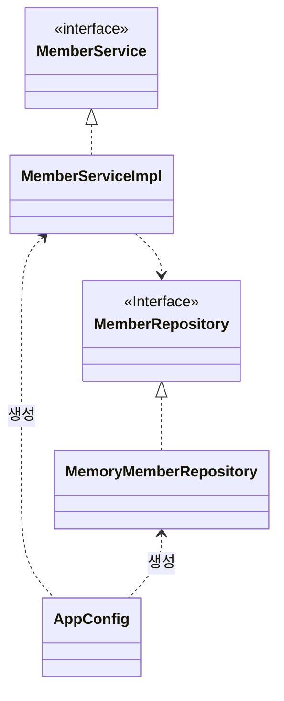

# IoC, DI

- [최대한 SOLID를 지키려는 코드 예시](#최대한-solid를-지키려는-코드-예시)
- [AppConfig](#appconfig)
  - [결과](#결과)
- [IoC(Inversion of control) - 제어 역전](#iocinversion-of-control---제어-역전)
- [DI(Dependency injection) 의존성 주입](#didependency-injection-의존성-주입)
- [출처](#출처)

## 최대한 SOLID를 지키려는 코드 예시


```java
public interface MemberService {
    void join(Member member);
    Member findMember(Long memberId);
}
```

```java
public class MemberServiceImpl implements MemberService {
    private final MemberRepository memberRepository = new MemoryMemberRepository();

    @Override
    public void join(Member member) {
        memberRepository.save(member);
    }
    // ...
}
```

```java
public interface MemberRepository {
    void save(Member member);
    Member findById(Long memberId);
}

```

```java
public class MemoryMemberRepository implements MemberRepository{
    private static Map<Long, Member> store = new HashMap<>();

    @Override
    public void save(Member member) {
        store.put(member.getId(), member);
    }
    // ...
}
```

```java
public class JdbcMemberRepository implements MemberRepository{
    private static Map<Long, Member> store = new HashMap<>();

    @Override
    public void save(Member member) {
        store.put(member.getId(), member);
    }
    // ...
}
```

- 다형성 만으로 구현 객체를 변경할 때 클라이언트 코드도 함께 변경.
  - private final **MemberRepository** memberRepository = new **MemoryMemberRepository()**;
  - 인터페이스와 구현 클래스 모두에 의존.
- 다형성만으로 OCP, DIP를 지킬 수 없음.
- 뭔가 더 필요하다. = IoC 컨테이너, 스프링

## AppConfig



```java
public class MemberServiceImpl implements MemberService {
    private final MemberRepository memberRepository;
    public MemberServiceImpl(MemberRepository memberRepository) { // 생성자 의존성
        this.memberRepository = memberRepository;
    }
    // ...
}
```

```java
public class AppConfig {
    public MemberService memberService() {
        return new MemberServiceImpl(memberRepository()); // 생성자 의존성 주입
    }

    public MemberRepository memberRepository() {
        return new MemoryMemberRepository();
    }
}
```

```java
AppConfig appConfig = new AppConfig();
MemberService memberService = appConfig.memberService();
```

- 실행 영역과 구성 영역

  - 실행 영역 - 클라이언트
  - 구성 영역 - 객체의 생성과 연결을 담당

- 생성자 의존성 주입

  - `return new MemberServiceImpl(new MemoryMemberRepository());`

- 애플리케이션 동작에 필요한 구현 객체를 생성.
- 생성한 객체 인스턴스의 참조를 생성자를 통해 주입.

### 결과

- 설계 변경으로 MemberServiceImpl 은 MemoryMemberRepository 를 더 이상 의존하지 않는다!
  - 단지 MemberRepository 인터페이스만 의존.
- MemberServiceImpl 입장에서 생성자를 통해 어떤 구현 객체가 주입될지는 알 수 없다.
- MemberServiceImpl의 생성자를 통해서 어떤 구현 객체를 주입할지는 오직 외부( AppConfig )에서 결정된다. - 관심사 분리
- MemberServiceImpl 은 이제부터 의존관계에 대한 고민은 외부에 맡기고 실행에만 집중하면 된다.

## IoC(Inversion of control) - 제어 역전

- 일반적 제어

  - 프로그래머가 구현 객체 생성, 연결, 실행 하는 것.
  - 구현 객체가 프로그램의 제어 흐름을 결정.
  - 프로그래머에게 익숙하고 자연스러움.

- Inversion of control

  - 프레임워크가 구현 객체를 생성, 연결, 실행.
  - 구현 객체는 로직을 실행하는 역할만 함.
  - AppConfig가 프로그램의 제어 흐름을 결정.
  - 외부에서 관리하고 관리하는 것.

> 라이브러리 - 내가 작성한 코드가 직접 제어의 흐름을 담당함.  
> 프레임워크 - 프레임워크가 코드를 제어하고 실행함. (JUnit, Spring)

## DI(Dependency injection) 의존성 주입

- 클라이언트는 인터페이스에 의존. 어떤 구현 객체를 사용할지 모름.

- 정적인 클래스 의존 관계

  - 클래스가 사용하는 import로 쉽게 판단.
  - 애플리케이션을 실행하지 않아도 분석 가능.

- 동적인 객체 의존 관계
  - 어떤 구현 객체가 들어올지 코드만으로는 알 수 없음.
  - 런타임에 구현 객체를 생성하고 클라이언트에 **의존성 주입**.
  - 객체가 참조로 연결됨.
  - 정적인 클래스 의존관계를 변경하지 않고, 동적인 객체 의존만 변경 가능.

---

## 출처

- 스프링 핵심 원리 - 기본편 - <https://www.inflearn.com/course/스프링-핵심-원리-기본편>
