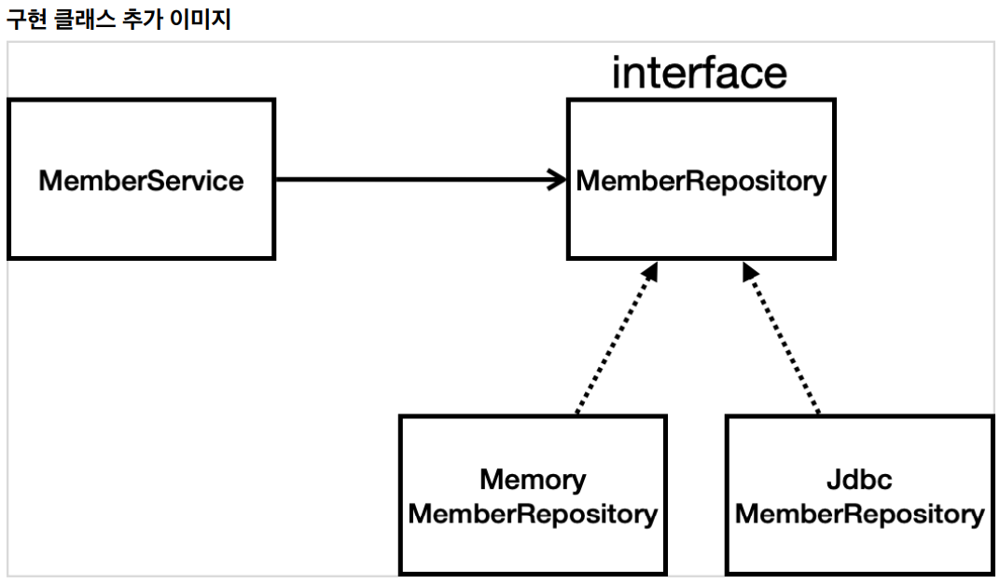
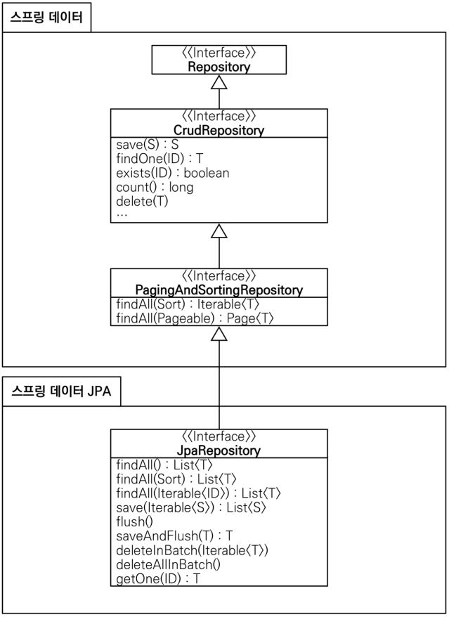

# 스프링DB

## H2 데이터베이스 설치

- 개발이나 테스트 용도로 가볍고 편리한 DB, 웹 화면 제공
- 1.4.200 버전 추천, 최신버전은 호환 문제 있음.

- https://www.h2database.com
- 다운로드 및 설치
  - h2 데이터베이스 버전은 스프링 부트 버전에 맞춘다.
  - 권한 주기: chmod 755 h2.sh (윈도우 사용자는 x)
  - 실행: ./h2.sh (윈도우 사용자는 h2.bat)
- 데이터베이스 파일 생성 방법
  - jdbc:h2:~/test (최초 한번)
  - ~/test.mv.db 파일 생성 확인
  - 이후부터는 jdbc:h2:tcp://localhost/~/test 이렇게 접속
    - 파일에 직접 접근이 아니라 소켓을 통해 접근.

## 순수JDBC

- springboot를 이용한 DB연결
- application.properties
  - spring.datasource.url=jdbc:h2:tcp//localhost/~/test
  - spring.datasource.driver-class-name=org.h2.Driver

### jdbc 구현 클래스 추가

> 개방-폐쇄 원칙(OCP, Open-Closed Princible)
>
> 확장에는 열려 있고, 수정, 변경에는 닫혀있다.
>
> 다형성으로 구현체를 변경
>
> 스프링의 DI을 사용하면 **기존 코드를 변경하지 않고, 설정만으로 구현 클래스를 변경 할 수 있음.**

- @SpringBootTest - 스프링 컨테닝너와 테스트를 함께 실행.
- @Transectional

  - 테스트 시에 테스트 하나 마다 트랜잭션을 만들고 테스트 후 커밋을 하지 않음.

- 통합테스트(SpringBootTest)보다 단위 테스트를 잘 쓰도록 노력하자!

## 스프링 JdbcTemplate

- JDBC API의 반복적인 코드를 제거해 줌.
- SQL은 여전히 직접 작성.

## JPA

- ORM
- 기본적인 SQL 생성해 줌.
- SQL과 데이터 중심의 설계에서 **객체 중심의 설계**로 패러다임 전환.
- 개발 생산성을 크게 높임.

- build.gradle

  - `implementation 'org.springframework.boot:spring-boot-starter-data-jpa'`

- application.properties

  - spring.jpa.show-sql=true - 콘솔에 sql문 표시
  - spring.jpa.hibernate.ddl-auto=none - 자동으로 테이블 생성

- entity 맵핑

  - @Entity - 엔티티 정의
  - @Id - PK
  - @GeneratedValue(strategy = GenerationType.IDENTITY)

- @Transactional
  - JPA를 쓰기 위해선 서비스에 트랜잭션을 설정해줘야 함.

## 스프링데이터 JPA

- 리포지토리에 구현 클래스 없이 인터페이스 만으로 개발을 완료할 수 있음.
- 반복 개발해온 기본 CRUD 기능도 모두 제공.
- 개발자는 핵심 비즈니스 로직을 개발하는데, 집중할 수 있음.

- 스프링 데이터 JPA는 JPA를 편리하게 사용하도록 도와주는 기술.
- JPA를 먼저 학습한 후에 사용 권장.

- JapRepository의 구현체를 프록시로 구현하여 스프링 빈으로 자동 등록.

- 실무에서는 JPA와 스프링 데이터 JPA를 기본으로 사용.
- Querydsl - 복잡한 동적 쿼리는 작성 라이브러리.
  - 쿼리를 자바 코드로 안전하게 작성
  - 동적 쿼리도 편리하게 작성.
