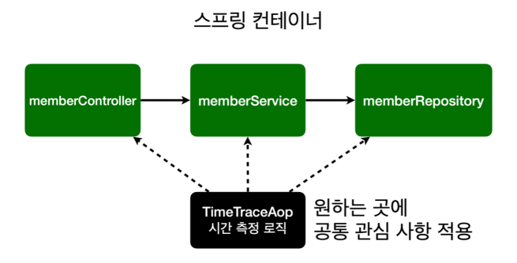
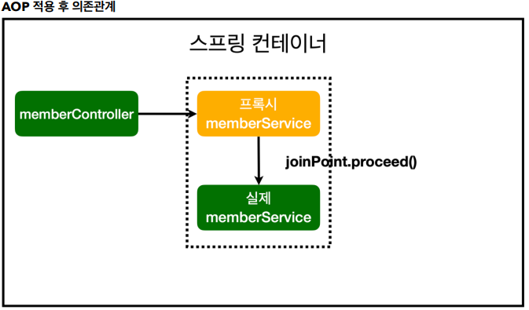

# 07 AOP

## AOP

- AOP: Aspect Oriented Programming
- 공통 관심 사항(cross-cutting concern) vs 핵심 관심 사항(core concern) 분리

## AOP가 필요한 상황

- 모든 메소드의 호출 시간을 측정하고 싶다면?
- 공통 관심 사항(cross-cutting concern) vs 핵심 관심 사항(core concern)
- 회원 가입 시간, 회원 조회 시간을 측정하고 싶다면?

## AOP 장점

- 회원가입, 회원 조회등 핵심 관심사항과 시간을 측정하는 공통 관심 사항을 분리한다.
- 시간을 측정하는 로직을 별도의 공통 로직으로 만들었다.
- 핵심 관심 사항을 깔끔하게 유지할 수 있다.
- 변경이 필요하면 이 로직만 변경하면 된다.
- 원하는 적용 대상을 선택할 수 있다.

## Bean 등록

- 컴포넌트로 등록 할 수도 있지만, 일반적이지 않은 클래스는 빈으로 직접 등록하자.
- 어떤 AOP를 걸어 놨는지 나중에 확인이 편함.

## 스프링 AOP의 작동방식

- AOP가 적용되야 하는 빈의 프록시(가짜 빈)를 생성.
- 프록시 안에서 joinPoint.proceed()로 원래 빈을 실행.

