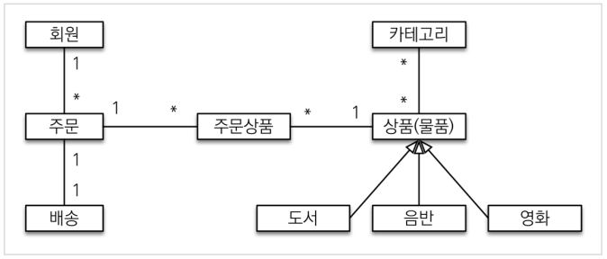
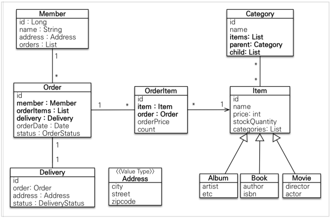
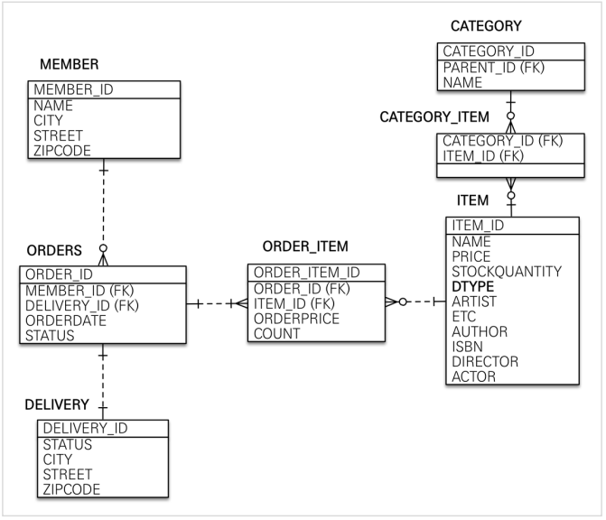

# 도메인 분석 설계

## 요구사항 분석

- 회원

  - 등록
  - 조회

- 상품

  - 등록
  - 수정
  - 조회

- 주문

  - 상품 주문
  - 주문 내역 조회
  - 주문 취소

- 기타

  - 상품 재고 관리
  - 상품 종류는 도서, 음반, 영화
  - 상품을 카테고리로 구분
  - 상품 주문시 배송 정보 입력

## 도메인 모델과 설계

- Domain model
  

- classDiagram
  

  - 회원(Member) - 주문과 양방향 관계
  - 주문상품(OrderItem) - 주문(Order)과 상품(Item)에 다대일 관계.
  - 카테고리(Category) - 상품과 다대다 관계
  - 배송(Delivery) - 주문과 일대일 관계
  - 상품 상속관계

  > 잘못된 설계  
  > 예제를 위해서 다양한 설계를 넣었을 뿐, 좋은 설계는 아님.  
  > 양방향 의존 제거 - 사실 멤버는 오더리스트를 가질 필요가 없음.  
  > 다대다 관계 제거 - 상품과 카테고리

## 회원 테이블 분석

- Entity Relationship Diagrams
  

  - ITEM
    - 앨범, 도서, 영화 타입을 통합해서 하나의 테이블
    - DTYPE 컬럼으로 타입을 구분

  > ORDERS 테이블 - ORDER가 쿼리 예약어 이므로 테이블명은 ORDERS

  > DB 테이블명, 컬럼명 스타일
  > 소문자 + \_(언더스코어) 스타일을 사용
  > 대문자 + \_(언더스코어)
  > 둘 중에 하나를 지정해서 **일관성 있게 사용**

## 연관관계 매핑 분석

- 회원과 주문

  - 양방향 연관 관계
  - 일대다 관계
    - _다_ 인 Order가 맴버의 외래키(FK)를 가짐.
  - 양방향 연관 관계는 _주인_ 필요.
    - 주인 쪽의 값을 변경해야 반영됨.
  - Order가 연관 관계의 주인. 외래키를 가지는 쪽을 하는 것.
    - `Order.member`를 `ORDERS.MEMBER_ID` 외래키와 맵핑
  - Member가 거울(주인 반대 사이드)

- 주문상품(OrderItem)과 주문(Order)

  - 다대일 양방향 관계.
  - 외래키가 주문상품에 있으므로 주인.

- 주문상품(OrderItem)과 상품(Item)

  - 일대다 단방향 관계.

- 주문(Order)와 배송(Delivery)

  - 일대일 단방향 관계.
  - `Order.delivery`를 `ORDERS.DELIVERY_ID`와 맵핑

- 카테고리와 상품

  - 다대다 관계(@ManyToMany)

    > 다대다 쓰지 말자.

  - CATEGORY_ITEM 테이블을 넣어서 연결.

> 외래 키가 있는 곳을 연관관계의 주인으로 정하라!  
> 연관관계의 주인은 단순히 외래 키를 누가 관리하냐의 문제이지 비즈니스상 우위에 있다고 주인으로 정하면 안된다. 예를 들어서 자동차와 바퀴가 있으면, 일대다 관계에서 항상 다쪽에 외래 키가 있으므로 외래 키가 있는 바퀴를 연관관계의 주인으로 정하면 된다. 물론 자동차를 연관관계의 주인으로 정하는 것이 불가능 한 것은 아니지만, 자동차를 연관관계의 주인으로 정하면 자동차가 관리하지 않는 바퀴 테이블의 외래 키 값이 업데이트 되므로 관리와 유지보수가 어렵고, 추가적으로 별도의 업데이트 쿼리가 발생하는 성능 문제도 있다. 자세한 내용은 JPA 기본편을 참고하자.

## 엔티티 클래스 개발

- 엔티티 가급적 Getter는 열고 Setter는 최소화 하자.

- 엔티티 식별자는 `id`, PK 칼럼명은 `member_id`
  - 엔티티는 타입으로 쉽게 유추 가능. Member.id
  - DB에선 조인 할때 헷깔리기 때문에. 테이블명+id
- 중요한 것은 _일관성_, 다른 형태로도 해도 됨.

- 주소 엔티티
  - 값 타입은 변경 불가능하게 설계해야 한다.
  - @Setter 를 제거하고, 생성자에서 값을 모두 초기화해서 변경 불가능한 클래스를 만들자.
  - JPA 스펙상 엔티티나 임베디드 타입( @Embeddable )은 자바 기본 생성자(default constructor)를 public 또는 protected 로 설정해야 한다. public 으로 두는 것 보다는 protected 로 설정하는 것이 그나마 더 안전하다.
  - JPA가 이런 제약을 두는 이유는 JPA 구현 라이브러리가 객체를 생성할 때 _리플랙션_ 같은 기술을 사용할 수 있도록 지원해야 하기 때문.

### 연관 관계 주인

- 데이타베이스 연관 관계와 매핑.
- 외래키를 관리(등록, 수정, 삭제) 가능.
- 주인이 아닌 쪽(거울)은 읽기만 가능.

- 양쪽 객체 모두 변경이 가능하면 JPA는 어느 쪽을 기준으로 업데이트 해야 할 지 모른다.
- 한 쪽을 주인으로 설정하는 것.
- 외래키를 가진 테이블의 엔티티를 주인으로 설정하는 것이 편함.

- @OneToMany(mappedBy = "member") 거울 설정

- @OneToOne
  - 일대일 관계
  - 누가 FK를 가질 것인가? 주인으로 설정할 것인가?
    - 많이 엑세스하는 것.
  - 주문을 배송보다 자주 접근 할 것이므로 주문을 주인으로.

## 엔티티 설계시 주의점

- 가급적 Setter를 사용하지 말자.

  - 변경 포인트가 많으면 유지보수가 어려움.
  - Setter 없이 어떻게? 다 방법이 있음.???

- 모든 연관관계는 지연로딩(LAZY)으로 설정.

  - 즉시 로딩(EAGER)는 예측이 어려움.
  - SQL 추적이 어려움.
  - 함께 DB에서 조회를 해야한다면, **fetch join** 또는 엔티티 그래프 기능을 사용.
  - @OneTo*One*, @ManyTo*One*은 디폴트가 EAGER이르모 LAZY로 설정 할 것.

  ```java
  @ManyToOne(fetch = FectchType.EAGER)
  @JoinColumn(name = "member_id")
  private Member member;
  ```

  - **N+1 문제**가 발생 할 수 있음.
    - JPA를 쓰면 원래 join으로 조회 해와야 하지만,
    - JPQL `select o from order O;`는 SQL `select * from order`로 번역되어 실행 됨.
    - 동시에 FectchType.EAGER 옵션으로 member는 n건 조회 함.
    - 즉시 로딩(EAGER)은 꼭 가져오겠다는 것.

- 컬렉션은 필드에서 초기화 하자.

  - 컬렉션은 필드에서 바로 초기화 하는 것이 안전하다.
  - `private List<Order> orders = new ArrayList<>();`
  - null 체크를 하지 않아도 됨.
  - 하이버네이트는 엔티티를 영속화 할 때, 컬렉션을 감싸서 하이버네이트가 제공하는 내장 컬렉션으로 변경. 따로 초기화하면 하이버네이트 내부 메커니즘에 문제가 발생 할 수도 있음.
    - 하이버네이트가 객체를 추적해야하므로.

- 테이블, 컬럼명 생성 전략

  - 스프링 부트에서 하이버네이트 기본 매핑 전략을 변경해서 실제 테이블 필드명은 다름
  - SpringPhysicalNamingStrategy - 스프링 부트 신규 설정 (엔티티(필드) 테이블(컬럼))

    1. 카멜 케이스 -> 언더스코어(memberPoint member_point)
    2. .(점) -> \_(언더스코어)
    3. 대문자 -> 소문자

  - 적용 2단계
    1. 논리명 생성: 명시적으로 컬럼, 테이블명을 직접 적지 않으면 ImplicitNamingStrategy 사용
       `spring.jpa.hibernate.naming.implicit-strategy` : 테이블이나, 컬럼명을 _명시하지 않을 때_ 논리명 적용
    2. 물리명 적용:
       `spring.jpa.hibernate.naming.physical-strategy` : 모든 논리명에 적용됨, 실제 테이블에 적용, 무조건 적용.
       (username usernm 등으로 회사 룰로 바꿀 수 있음)
    - 임의의 룰을 정의해서 사용 가능.

```java
public class Order {
    @OneToMany(mappedBy = "order", cascade = CascadeType.ALL)
    private List<OrderItem> orderItems = new ArrayList<>();
}
```

### 연관관계 영속성 전이

- `cascade = CascadeType.ALL`

  - orderItmes 안의 원소를 엔티티 하나하나를 저장 해주고 order를 저장해야 함
  - 원소가 3개면 아래와 같은 식으로 코드를 짜야 함.

  ```java
  persist(orderItemA);
  persist(orderItemB);
  persist(orderItemC);
  persist(order);
  ```

  - 불편하기 때문에 cascade옵션으로 내부 것을 저장하는건 생략해도 됨.
    - persist를 전파 하는 옵션
  - `persist(order);`만 쓰면 됨.

### 연관 관계 (편의) 메서드

- 양방향 관계일 때 양쪽 모두에 set을 해야 함.

```java
public static void main(String[] args) {
    Member member = new Member();
    Order order = new Order();
    // 양쪽으로 설정을 해줘야 서로 꼬이지 않음.
    member.getOrders().add(order);
    order.setMember(member);
}
```

- 하지만 매번 저렇게 쓰는 것은 불편하고, 사람이라 실수로 한쪽만 설정할 가능성이 있음.

- 양쪽을 동시에 설정하는 메서드를 추가
  - 양쪽 중에 어디에 있어야 하는가?
  - 핵심적으로 컨트롤 하는 쪽에서 가지고 있는 것이 좋음.

```java
public void setMember(Member member) {
    this.member = member;
    member.getOrders().add(this);
}
```

## 구현 설계

- 구현하지 않을 것
  - 로그인과 권한 관리 X
  - 파라미터 검증과 예외 처리 단순화
  - 상품은 도서만 사용
  - 카테고리 사용 X
  - 배송 정보 사용 X

## 애플리케이션 아키텍처

- 계층형 구조 사용
  - controller, web
  - service
  - repository
  - domain - 엔티티가 모여 있는 계층
- 패키지 구조
  - domain
  - exception
  - repository
  - service
  - web
